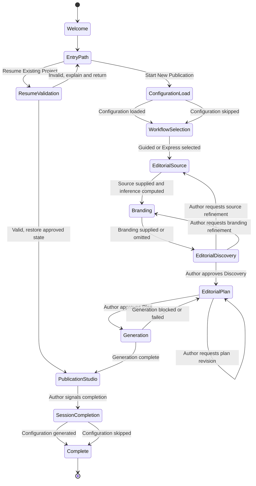
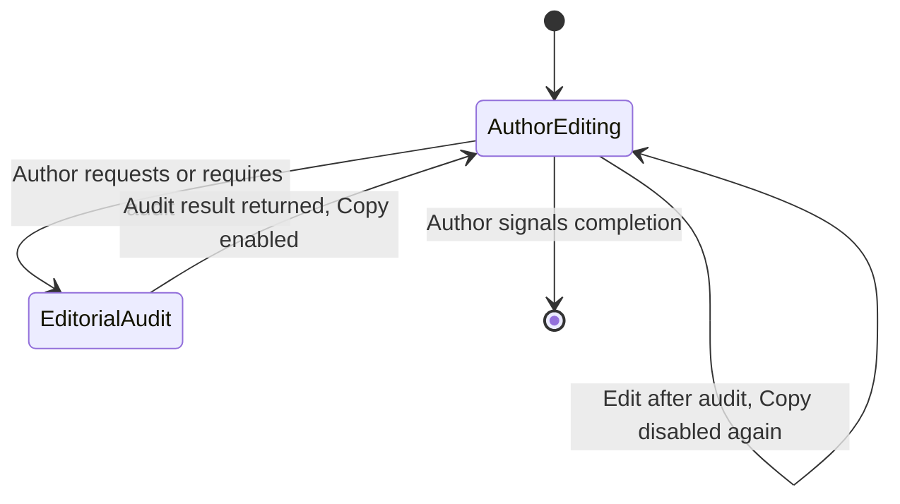

# Version 1.1 State Machine

## Status

Proposed - pending delivery. Revised per Architecture Review Board findings
dated 2026-08-03, and further revised to integrate the Repository Author's
resolution of the Editorial Audit Gate and Resume Existing Project placement
decisions.

## Purpose

This document defines the authoritative session state model for the Version
1.1 Author Journey described in
`docs/product/Version_1_1_Author_Experience_Baseline.md`. It exists so that
an implementing engineer can build the session flow directly from state
definitions, transitions, and guard conditions, without inferring behaviour
from prose alone.

There is exactly one Author Journey state machine. The Guided Workflow and the
Express Workflow, defined in the Baseline, are two presentations of this same
state machine. Express Workflow may combine the rendering of adjacent states
into a single screen; it does not add, remove, reorder, or skip any state or
transition defined here.

## Scope

This document models the Author-facing session flow only. It does not model:

- internal Editorial Integrity Pipeline sub-states (source assessment,
  evidence verification, LMHS Editorial Risk derivation), which remain
  governed by Version 1.0 architecture documents; or
- Article Engine or Hero Visual System generation-failure handling, which
  remain governed by their existing Version 1.0 contracts.

Where Generation depends on those existing contracts, this document does not
redefine their internal behaviour and defers to
`docs/architecture/Article_Engine_and_Publication_Package.md` and
`docs/architecture/Hero_Visual_System.md` for it. It does model Generation's
two possible outcomes — completion and block-or-failure — as an
Author-facing transition, because both outcomes determine what state the
session is in next, which this document is responsible for defining.

This document models Resume Existing Project's entry point into the Version
1.1 Author Journey — where it branches from Welcome and where it rejoins the
rest of this state machine — but not its internal validation, deserialization,
or Temporal Integrity review logic, which remain governed by the existing
Version 1.0 Capability 011 specification and are not redefined here.

## Top-Level Session State Diagram

Any state prior to Complete may also transition directly to `[*]` if the
Author leaves the session. This is omitted from the diagram for readability
and is governed by the Leaving a Session Before Complete invariant below, not
by a drawn transition, because it is not a state the Author is guided into —
it is simply the absence of the next expected transition.

Publication Studio is entered from exactly two places: Generation completing,
or a valid resumed project. Both are the only two ways it is ever entered;
see the Publication Studio is entered at most once per session invariant
below. The Copy LinkedIn Publication gate introduced by the Editorial Audit
Gate decision is a property of the Author Editing state's behaviour, not a
separate node, and is specified in Publication Studio Detail and the
Author Editing state description below.

## Publication Studio Detail

Publication Studio is a composite state. It is entered exactly once per
session, either immediately after a completed Generation or immediately
after a validated Resume, and is not re-entered after Session Completion
begins.

Editorial Audit never transitions Publication Studio to any state other than
back to Author Editing. It has no path to Generation, Editorial Plan, or any
earlier state. Requesting an audit is always available and never destructive.

Author Editing carries one additional piece of state beyond the publication
content itself: whether the most recent Editorial Audit result still matches
the currently displayed content. Copy LinkedIn Publication is enabled only
when it does. Any edit made after an audit sets this back to unmatched,
shown above as the `AuthorEditing --> AuthorEditing` self-transition; a new
Editorial Audit is the only way to set it back to matched. This is the
Editorial Audit Gate specified in full in the Baseline's Editorial Audit
section and in `docs/architecture/adr/ADR-018-author-ownership-and-publication-studio.md`.

## State Descriptions

### Welcome

**Entry:** Session start.
**Author sees:** An introduction to the Studio and its stateless nature.
**Exit condition:** Automatic transition to Entry Path.
**Data held:** None. No prior session data exists at this point.

### Entry Path

**Entry:** From Welcome.
**Author sees:** A choice between Start New Publication and Resume Existing
Project.
**Exit condition:** One of two Author decisions:
- Start New Publication. Transition to Configuration Load.
- Resume Existing Project. Transition to Resume Validation.
**Data held:** None. This choice is made once per session and is not
revisited except by returning here after a failed Resume Validation.
**Guiding Principle:** Progressive Disclosure; Every Artifact Has One
Responsibility, as applied to the two continuity mechanisms available at
this point. See Resume Validation and Configuration Load below.

### Resume Validation

**Entry:** From Entry Path, on Resume Existing Project.
**Author sees:** A prompt to supply a Portable Editorial Project file, then
either the restored session state or an explanation of why the file could
not be resumed.
**Exit condition:** One of two outcomes:
- **Valid.** The project passes validation, `EditorialSession.resume()`
  applies, and Temporal Integrity review completes as specified in Version
  1.0. Transition directly to Publication Studio with the project's approved
  content restored.
- **Invalid.** Validation fails. The Studio explains why the project could
  not be resumed. Transition back to Entry Path.
**Data held:** On success, the restored Publication Package components, Hero
Visual reference, and package readiness/risk/confidence state, exactly as
defined by the existing Portable Editorial Project schema. This document does
not redefine that schema, its validation rules, or its Temporal Integrity
behaviour. On failure, no session data is retained.
**Guard:** This state never reads or applies a Ramrattan AI Configuration.
Configuration Load does not exist on this path.
**Guiding Principle:** Author-Controlled Continuity; Every Artifact Has One
Responsibility. See
`docs/architecture/adr/ADR-019-studio-configuration-and-author-controlled-continuity.md`.

### Configuration Load

**Entry:** From Entry Path, on Start New Publication.
**Author sees:** An optional prompt to supply a Ramrattan AI Configuration
file (`.json`, filename pattern
`Ramrattan-AI-Configuration-[YYYY.MM.DDvNN]`).
**Exit condition:** The Author loads a file, or skips this state. Both paths
lead to Workflow Selection.
**Data held:** If loaded, exactly two fields for the current session only:
the preferred Workflow mode and the Branding preference last used, as defined
in `docs/architecture/adr/ADR-019-studio-configuration-and-author-controlled-continuity.md`.
The Studio does not persist this file beyond the session.
**Data flow:** The Workflow mode, if loaded, pre-selects Workflow Selection's
choice without skipping it — the Author still confirms or changes it. The
Branding preference, if loaded, is carried forward and shown for confirmation
when the Branding state is reached; it never bypasses that state. See
Workflow Selection and Branding below.
**Guiding Principle:** Author-Controlled Continuity. This state exists only
on the Start New Publication path; the Resume Existing Project path never
reaches it.

### Workflow Selection

**Entry:** From Configuration Load.
**Author sees:** A choice between the Guided Workflow and the Express
Workflow, as defined in the Baseline, pre-selected from a loaded
Configuration if one was supplied.
**Exit condition:** A workflow mode is selected or confirmed. Transition to
Editorial Source.
**Data held:** The selected workflow mode, used only to determine screen
presentation for subsequent states. The mode does not alter which states are
visited or which approvals are required. Under Express, exactly one
presentation change applies downstream: Editorial Source and Branding are
presented on one combined screen. No other state's presentation changes. See
Editorial Source and Branding below.

### Editorial Source

**Entry:** From Workflow Selection, or re-entered from Editorial Discovery
for refinement.
**Author sees:** A prompt for source material (URL, article, document,
research, topic, or notes) and, once supplied, the Studio's inferred
editorial intent, audience, platform, and desired outcome.
**Exit condition:** Source material is supplied and inference is computed.
Transition to Branding.
**Data held:** Editorial Source material and inferred intent, audience,
platform, and desired outcome, pending confirmation at Editorial Discovery.
**Presentation:** Under Guided Workflow, this is its own screen. Under
Express Workflow, this screen is combined with Branding into one intake
screen; the transition to Branding below still fires once source material is
supplied, unchanged in either mode.
**Guiding Principle:** Progressive Disclosure.

### Branding

**Entry:** From Editorial Source, or re-entered from Editorial Discovery for
refinement.
**Author sees:** A prompt asking whether the publication should reflect
personal or business branding, with optional material (website, logo,
headshot, brand colours, brand guide, presentation, previous Hero Visual, or
other visual references). If a Configuration was loaded, the Branding
preference it carried is shown here for confirmation, change, or clearing —
never silently applied.
**Exit condition:** Branding material is supplied or explicitly omitted.
Transition to Editorial Discovery.
**Data held:** Branding material if supplied, or an explicit record that the
Studio Theme will be used. The resolved value produced by this state is
referred to internally as Publication Identity; see ADR-018.
**Guard:** This state never reads Editorial Source content as an input. This
is a structural guard, not merely a behavioural one: no data path exists
between the two.
**Presentation:** Under Guided Workflow, this is its own screen. Under
Express Workflow, this screen is combined with Editorial Source, as described
above.
**Guiding Principle:** Every Artifact Has One Responsibility, as applied to
inputs rather than outputs. See
`docs/architecture/adr/ADR-018-author-ownership-and-publication-studio.md`.

### Editorial Discovery

**Entry:** From Branding.
**Author sees:** The Studio's complete understanding to this point: inferred
editorial intent, audience, platform, desired outcome, and the Branding
decision, presented together for confirmation.
**Exit condition:** One of three Author decisions:
- Approve as presented. Transition to Editorial Plan.
- Request source refinement. Transition to Editorial Source.
- Request branding refinement. Transition to Branding.
**Data held:** The confirmed or refined understanding carried forward into
Editorial Plan.
**Guiding Principle:** Evidence Before Generation; One Decision Per Step.

### Editorial Plan

**Entry:** From Editorial Discovery, or re-entered from Generation if blocked
or failed.
**Author sees:** A proposed Headline, Hook, Key Insights, Practical Takeaway,
and Call to Action; or, if re-entered from Generation, the prior plan
together with an explicit explanation of what was blocked or failed.
**Exit condition:** One of two Author decisions:
- Approve the plan. Transition to Generation.
- Request revision. Remain in Editorial Plan with an updated proposal.
**Data held:** The approved plan, which becomes the sole input to Generation.
**Guiding Principle:** Evidence Before Generation; Generate Once.

### Generation

**Entry:** From Editorial Plan, on approval.
**Author sees:** The Studio producing the complete publication from the
approved plan.
**Exit condition:** One of two outcomes:
- **Generation complete.** Transition to Publication Studio.
- **Generation blocked or failed.** Transition back to Editorial Plan with an
  explanation. A block indicates the approved plan would produce High or
  Severe Editorial Risk; a failure indicates a technical generation or
  validation failure unrelated to risk. Neither outcome produces a
  publication or enters Publication Studio.
**Data held:** On completion, the generated Publication Package components
and Hero Visual, produced by the existing Article Engine and Hero Visual
System contracts. On block or failure, no publication data is produced or
held.
**Guiding Principle:** Generate Once. Publication Studio is entered at most
once per session; a blocked or failed attempt does not count toward that
limit because it does not produce a publication. No state in this document
re-enters Generation from Publication Studio.

### Publication Studio — Author Editing

**Entry:** From Generation (Generation complete), from Resume Validation
(Valid), or re-entered from Editorial Audit.
**Author sees:** The two-workspace Publication Studio: the Hero Visual on the
left, and the fully editable Publication Editor on the right, alongside the
collapsible Editorial Review panel.
**Exit condition:** One of two Author decisions:
- Request an Editorial Audit. Transition to Editorial Audit.
- Signal completion. Transition to Session Completion.
**Data held:** The Author-edited publication, updated continuously as the
Author edits. The Studio does not write to this data; it only reads it for
display and for Editorial Audit. The Editorial Confidence and Editorial Risk
values shown in Editorial Review are not recomputed as part of this
continuous update; they reflect the most recent Generation, Resume, or
Editorial Audit only, and must be presented as such rather than implying live
freshness. See Editorial Review in the Baseline.
**Copy LinkedIn Publication gate:** This state tracks whether the most recent
Editorial Audit result still matches the currently displayed content
("matched" or "unmatched"). On entry from Generation or Resume Validation,
this flag starts unmatched — neither a fresh Generation nor a resumed
project satisfies the gate on its own. Any Author edit sets it to unmatched.
Only a completed Editorial Audit sets it to matched. Copy LinkedIn
Publication is enabled if and only if this flag is matched. See Publication
Studio Detail above and ADR-018.
**Guiding Principle:** Author Edits Freely; The Author Owns the Message;
Audit Before Publishing.

### Publication Studio — Editorial Audit

**Entry:** From Author Editing, on request or whenever the Author attempts to
use Copy LinkedIn Publication while the gate is unmatched.
**Author sees:** An LMHS Assessment, an Editorial Drift assessment, and a
Publication Readiness statement, evaluated against the current Author-edited
publication. If the LMHS Assessment is High or Severe, Publication Readiness
does not offer a positive recommendation and explains the risk; the Author's
content is not altered as a result.
**Exit condition:** Audit result is returned. Transition back to Author
Editing, automatically, with the Copy LinkedIn Publication gate set to
matched for the content just audited.
**Data held:** The audit result is presented to the Author. It is not written
back into the publication.
**Guiding Principle:** Audit Before Publishing. This state never mutates
Publication Content and never disables Copy LinkedIn Publication based on
what it finds — only the absence of a matching audit does that.

### Session Completion

**Entry:** From Author Editing, when the Author signals completion.
**Author sees:** The prompt: "Would you like to generate a Ramrattan AI
Configuration from today's session for future use?"
**Exit condition:** The Author accepts or declines. Both paths transition to
Complete.
**Data held:** If accepted, a generated Ramrattan AI Configuration file,
delivered to the Author and not retained by the Studio.
**Guiding Principle:** Author-Controlled Continuity.

### Complete

**Entry:** From Session Completion.
**Author sees:** Confirmation of the session's artifacts: the mandatory
Publication Package and Portable Editorial Project, and the optional
Ramrattan AI Configuration if generated.
**Exit condition:** Terminal state. The session ends.
**Data held:** None. The Studio retains nothing after this state is reached.
**Guiding Principle:** Stateless by Design.

## Transition Table

| From | To | Trigger | Guard | Notes |
|---|---|---|---|---|
| Welcome | Entry Path | Session start | None | Automatic |
| Entry Path | Configuration Load | Start New Publication selected | None | |
| Entry Path | Resume Validation | Resume Existing Project selected | None | |
| Resume Validation | Entry Path | Validation fails | Fail closed | Explanation shown; no session data retained |
| Resume Validation | Publication Studio | Validation succeeds | Portable Editorial Project schema and Temporal Integrity review satisfied | Bypasses Configuration Load through Generation entirely |
| Configuration Load | Workflow Selection | Configuration loaded | File matches supported format | Restores preferences for this session only |
| Configuration Load | Workflow Selection | Configuration skipped | None | Studio defaults apply |
| Workflow Selection | Editorial Source | Workflow mode selected | Guided or Express | Mode affects presentation only |
| Editorial Source | Branding | Source supplied, inference computed | None | Inference pending confirmation |
| Branding | Editorial Discovery | Branding supplied or omitted | Branding must not read Editorial Source data | Studio Theme applies if omitted |
| Editorial Discovery | Editorial Source | Author requests source refinement | None | Returns to source intake with prior material available |
| Editorial Discovery | Branding | Author requests branding refinement | None | Returns to branding intake |
| Editorial Discovery | Editorial Plan | Author approves Discovery | Intent, audience, platform, outcome, and branding all confirmed | Final gate before planning |
| Editorial Plan | Editorial Plan | Author requests revision | None | Self-transition; plan updated |
| Editorial Plan | Generation | Author approves Plan | Plan must be fully approved | Sole input to Generation |
| Generation | Editorial Plan | Generation blocked or failed | High/Severe Editorial Risk, or technical failure | Explanation shown; no publication produced |
| Generation | Publication Studio | Generation complete | Article Engine and Hero Visual System contracts satisfied | Occurs at most once per session |
| Publication Studio (Author Editing) | Publication Studio (Editorial Audit) | Author requests audit, or attempts Copy LinkedIn Publication while gate is unmatched | Publication must exist | Available any number of times |
| Publication Studio (Editorial Audit) | Publication Studio (Author Editing) | Audit result returned | None | Automatic; gate set to matched; never blocks editing |
| Publication Studio (Author Editing) | Publication Studio (Author Editing) | Author edits after a matched audit | None | Gate set back to unmatched |
| Publication Studio (Author Editing) | Session Completion | Author signals completion | None | No audit required to reach Session Completion; the gate governs Copy LinkedIn Publication only |
| Session Completion | Complete | Configuration generated | Author accepted | File delivered, not retained |
| Session Completion | Complete | Configuration skipped | Author declined | No file produced |

## Invariants

These invariants hold across every valid session and should be enforced by
implementation, not merely described by it:

1. **Publication Studio is entered at most once per session, from exactly one
   of two sources: a completed Generation, or a validated Resume.** A session
   may attempt Generation more than once only if every prior attempt was
   blocked or failed before producing a publication. A session that enters
   Publication Studio via Resume Validation never reaches Generation at all.
   Once Publication Studio is entered, by either path, no transition in this
   document re-enters Generation or Resume Validation.
2. **Branding never receives Editorial Source data as input**, and Editorial
   Source never receives Branding data as input, in either direction.
3. **Editorial Audit never transitions to any state other than Author
   Editing.** It cannot reach Generation, Editorial Plan, Editorial Discovery,
   Editorial Source, or Branding.
4. **No state after Generation writes to Publication Content except Author
   Editing, and only as a direct result of an Author edit.**
5. **The Studio holds no data once Complete is reached.** Every artifact
   referenced in Complete is a file already delivered to the Author, not a
   Studio-held record.
6. **Workflow mode (Guided or Express) never changes which states are
   visited or which approvals are required.** It changes only that Editorial
   Source and Branding are presented on one combined screen under Express,
   and on separate screens under Guided. No other state's presentation
   changes.
7. **Editorial Confidence and Editorial Risk in Editorial Review are
   recomputed only at Generation and at each Editorial Audit**, never
   continuously as the Author edits.
8. **Any state prior to Complete may be exited by the Author leaving the
   session, with no Session Artifact produced.** No cancel, abort, or restart
   transition exists because none is required; see Leaving a Session Before
   Complete in the Baseline.
9. **Copy LinkedIn Publication is enabled if and only if the Copy LinkedIn
   Publication gate is matched.** The gate starts unmatched on every entry
   into Author Editing, is set to matched only by a completed Editorial
   Audit, and is set back to unmatched by any subsequent Author edit. No
   Editorial Audit result, including High or Severe Editorial Risk, disables
   the action once matched; only a new edit does.
10. **Configuration Load and Resume Validation never occur in the same
    session.** A session takes exactly one of the two paths from Entry Path;
    a resumed project's restored state is never combined with, or
    overwritten by, a loaded Configuration.

## Cross-References

- `docs/product/Version_1_1_Author_Experience_Baseline.md` — canonical
  narrative specification of every state in this document, including the
  Entry Path and Editorial Audit Gate decisions this document models.
- `docs/architecture/adr/ADR-018-author-ownership-and-publication-studio.md`
  — architectural decision governing the Publication Studio, Branding
  independence, and Copy LinkedIn Publication gate invariants.
- `docs/architecture/adr/ADR-019-studio-configuration-and-author-controlled-continuity.md`
  — architectural decision governing Configuration Load and its non-overlap
  with Resume Validation.
- `docs/product/Version_1_1_Acceptance_Criteria.md` — testable criteria
  derived from these states and transitions.
