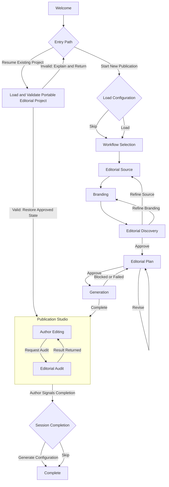

# Version 1.1 Author Experience Baseline

## Status

Proposed - pending delivery. Revised per Architecture Review Board findings
dated 2026-08-03, and further revised to integrate the Repository Author's
resolution of the Editorial Audit Gate and Resume Existing Project
decisions. This document does not carry Accepted, Complete, Current, or
Delivered status until Version 1.1 is implemented and delivered against it.

## Supersedes

This document extends `docs/product/Release_v1.0.md` and `docs/product/PRD_v1.3.md`.
It does not modify the Version 1.0 Editorial Integrity Pipeline, Article Engine,
Hero Visual System, or Portable Editorial Project runtime described in those
documents and their governing ADRs. Version 1.1 changes how the Author
experiences and controls the Studio. It does not change what the Studio is
permitted to assert, verify, or publish.

## Companion Documents

- `docs/architecture/adr/ADR-018-author-ownership-and-publication-studio.md`
  records the durable architectural decision governing Publication Studio.
- `docs/architecture/adr/ADR-019-studio-configuration-and-author-controlled-continuity.md`
  records the durable architectural decision governing Studio Configuration.
- `docs/architecture/Version_1_1_State_Machine.md` records the session state
  model, transitions, and diagrams.
- `docs/product/Version_1_1_Acceptance_Criteria.md` records implementation-ready
  acceptance criteria.
- `docs/product/Version_1_1_Design_Rationale.md` records the reasoning behind
  this baseline for future contributors.

These six documents are complementary views of one architecture. Terminology,
sequencing, and behaviour must remain identical across all six.

## Executive Summary

Version 1.0 proved that the Studio can carry an Author from a natural starting
point to a complete, evidence-checked publication package. Version 1.1 does not
change that proof. It changes what happens around it.

Version 1.1 introduces the Publication Studio: a workspace in which the Studio
generates a complete publication exactly once, and the Author then owns every
word. There is no rewrite button, no regenerate button, and no improvement
loop. The Studio's editorial judgement is not withdrawn — it remains visible in
a separate Editorial Review panel and is available on demand through the
Editorial Audit — but it is never applied to the Author's text without the
Author's own hand.

Version 1.1 also introduces Studio Configuration: an optional, Author-owned
file that carries publication preferences from one stateless session into the
next, without the Studio ever storing anything on the Author's behalf.

Together, these changes complete the Author Journey that Version 1.0 began:
from a stateless welcome, through a single well-evidenced generation, to a
workspace the Author fully controls, and back out to a stateless, Author-owned
set of artifacts.

## Purpose

This document is the canonical specification of the Version 1.1 Author
Experience. It exists so that:

- product, design, and engineering share one description of the approved
  workflow;
- an implementing engineer or coding agent can build Version 1.1 without
  requesting additional product clarification;
- future contributors can understand what Version 1.1 changed and why, without
  reconstructing the decision from conversation history; and
- the Guiding Principles that shaped Version 1.0 continue to govern Version
  1.1 without dilution.

## Scope

### In Scope

- The complete Author-facing session flow from Welcome to Complete.
- Studio Configuration: loading and generating a portable preferences file.
- Editorial Source and Branding as two independent inputs.
- Editorial Discovery and Editorial Plan as explicit, Author-approved gates
  before generation.
- Publication Studio as the sole post-generation workspace.
- The separation of Publication Content from Editorial Review.
- Editorial Audit as an on-demand, analysis-only capability available after
  Author edits.
- The Guided Workflow and the Express Workflow as two presentations of the
  same underlying session.

### Out of Scope

- Any change to the Editorial Integrity Pipeline's internal assessment logic
  (Evidence Validation, Claim Classification, LMHS Editorial Risk derivation).
- Any change to the Article Engine, Hero Visual System, or Portable Editorial
  Project runtime contracts established in Version 1.0.
- User accounts, server-side profiles, hosted storage, or any form of
  persistent memory.
- Direct publishing to any external platform.
- The Portable Author Context described in
  `docs/product/version2/Capability_012_Portable_Author_Context.md`. That
  document remains an unapproved Version 2 candidate and is unrelated to
  Studio Configuration. See Future Considerations.

## Repository Author Decisions

Two decisions were left open in the prior revision of this baseline and have
since been resolved by the Repository Author. Both are recorded in full where
they apply — Editorial Audit for the first, Entry Path and Studio
Configuration for the second — and are summarized here for a reader who wants
the outcome without the full context:

1. **Editorial Audit Gate.** A completed Editorial Audit, reflecting the
   current edited state, is required before Copy LinkedIn Publication is
   enabled. High or Severe risk does not disable the action; it withholds a
   positive readiness recommendation. See Editorial Audit and ADR-018.
2. **Resume Existing Project.** Resume Existing Project is a distinct entry
   path from Welcome, a sibling to Start New Publication, restoring a
   validated Portable Editorial Project's approved state directly into
   Publication Studio. See Entry Path and Studio Configuration.

Both decisions are architectural completions of the design already approved
elsewhere in this document, not changes to it. Neither introduces new
functionality beyond resolving how already-approved mechanisms connect to
each other.

## Guiding Principles

The following principles are authoritative for Version 1.1. Every section of
this document, and every companion document, must remain consistent with all
eleven.

1. **Trust Before Convenience.** Speed and ease never override evidence,
   attribution, or Author control. Where this document must choose between a
   faster path and a more honest one, it chooses the honest one.
2. **The Author Owns the Message.** The Studio may propose, structure, and
   evidence a publication. It never owns the words that leave the session.
3. **Stateless by Design.** The Studio retains nothing between sessions. Every
   form of continuity is a file the Author holds, not a record the Studio
   keeps.
4. **Evidence Before Generation.** Generation follows an approved Editorial
   Plan built on an approved Editorial Discovery. The Studio does not write
   before the Author has confirmed what is being written and why.
5. **Generate Once.** The Studio produces the complete publication in a single
   generative act. It does not offer to try again, try differently, or try
   harder. A blocked or failed attempt that never produces a publication is
   not a generation in this sense; Generate Once governs the one successful
   act that opens Publication Studio, not the number of attempts that
   preceded it. See Editorial Plan and Generation.
6. **Author Edits Freely.** Once generated, the publication belongs entirely
   to the Author. Editing is unrestricted, unstructured, and never mediated by
   the Studio.
7. **Audit Before Publishing.** The Author may ask the Studio to review edited
   work for drift, risk, and readiness at any time, and must do so at least
   once, against the current edited content, before Copy LinkedIn Publication
   is enabled. The Studio evaluates. It does not correct, and a High or
   Severe result never disables the action or triggers a rewrite — it only
   withholds a positive recommendation.
8. **Author-Controlled Continuity.** Configuration and project files are
   generated for the Author, delivered to the Author, and never retained by
   the Studio.
9. **Progressive Disclosure.** The Author is asked one meaningful question at
   a time, in the order that question becomes relevant, and never before.
10. **One Decision Per Step.** Each stage of the Author Journey resolves one
    decision. Stages are not combined in a way that obscures what is being
    approved.
11. **Every Artifact Has One Responsibility.** Publication Package, Portable
    Editorial Project, and Ramrattan AI Configuration each serve exactly one
    purpose and are never conflated. See Session Artifacts.

## Author Journey

The Author Journey is the complete sequence of stages from the beginning of a
session to its end. It is the single authoritative session flow. The Guided
Workflow and the Express Workflow are two presentations of this same flow, not
two different flows.



Publication Studio is drawn as a boundary, not a single box, because Author
Editing and Editorial Audit are both states within it, not stages that follow
it. An Author remains inside this boundary — editing, optionally auditing,
editing again — for the entire remainder of the session. Resume Existing
Project is the second way to enter that boundary, alongside the Generation
path; both are the only two ways Publication Studio is ever entered. Copy
LinkedIn Publication's gating condition is a property of Author Editing, not
a separate state, and is specified in Editorial Audit and Publication Studio
below rather than drawn as a node here. Full state transitions, guard
conditions, and re-entrant loops are recorded in
`docs/architecture/Version_1_1_State_Machine.md`.

### Entry Path

Welcome resolves into exactly one of two paths, chosen once and not offered
again within the same session:

- **Start New Publication** — the path described throughout the rest of this
  document: an optional Configuration load, Workflow Selection, and the full
  sequence through Generation.
- **Resume Existing Project** — supplying a Portable Editorial Project file
  for validation. A valid project restores its own previously approved
  session state directly into Publication Studio, bypassing Configuration
  Load, Workflow Selection, Editorial Source, Branding, Editorial Discovery,
  Editorial Plan, and Generation entirely for that session. An invalid
  project fails closed: the Studio explains why the project could not be
  resumed and returns the Author to the Entry Path choice, offering another
  attempt or Start New Publication instead. See Studio Configuration for the
  full relationship between this path and Configuration.

### Session Lifecycle

A Version 1.1 session begins at Welcome and ends at Complete. Nothing that
happens between those two points survives the session inside the Studio. The
only things that outlive the session are files the Author explicitly chose to
generate: the Publication Package, the Portable Editorial Project, and,
optionally, a Ramrattan AI Configuration. This is the direct expression of
Stateless by Design and Author-Controlled Continuity: continuity is a property
of what the Author holds, never a property of what the Studio remembers.

### Leaving a Session Before Complete

Because the Studio is Stateless by Design, no explicit cancel, abort, or
restart transition exists or is required. An Author may leave a session at
any point before Complete simply by ending the interaction. Doing so discards
all in-session state; no Session Artifact is produced unless the session
reaches Complete. This applies identically before and after Generation. There
is no partial-save path outside of Session Completion.

### Guided Workflow

The Guided Workflow presents every stage of the Author Journey as its own
screen with its own approval. Editorial Source, Branding, Editorial Discovery,
and Editorial Plan are each shown, explained, and approved individually. This
is the default workflow and the clearest expression of One Decision Per Step
and Progressive Disclosure. It is recommended for a first session, an
unfamiliar publication type, or any session in which the Author wants to
review every inference before it is used.

### Express Workflow

The Express Workflow presents the same stages, in the same order, governed by
the same approval requirements, but combines exactly one pair of adjacent
screens: **Editorial Source and Branding are presented on a single combined
intake screen.** The Author supplies source material and states a Branding
preference together, in one interaction, rather than on two separate screens.

No other stage is combined with any other. Editorial Discovery remains its
own screen in both workflows, because it presents inference the Studio can
only compute after Editorial Source has been supplied and processed —
inference that does not exist yet at the moment Editorial Source and Branding
are being collected. Editorial Plan remains its own screen in both workflows,
because it is the final approval before an irreversible Generation and
warrants undivided attention regardless of workflow mode.

This single combination point is safe specifically because Editorial Source
and Branding are architecturally independent inputs (see Branding and
ADR-018): combining their intake screens carries no risk of one silently
informing the other, because no data path between them exists in either
workflow mode.

If the Author loaded a Studio Configuration, the combined Editorial
Source/Branding screen opens with the Branding preference from that
configuration shown for confirmation rather than blank, as described in
Studio Configuration. The Author may accept, change, or clear it before
proceeding; loading a configuration never causes Branding to be silently
applied without being shown.

The Express Workflow never removes a required approval. It never infers
Branding from Editorial Source. It never allows Generation to begin without an
approved Editorial Plan. Express Workflow is a reduction in navigation, not a
reduction in governance. This is the express application of Trust Before
Convenience: the Studio may become faster to use, but never at the cost of
what it verifies or what it asks the Author to confirm.

The choice between Guided Workflow and Express Workflow is made once, at
Workflow Selection, and may be offered again at the start of any future
session.

## Studio Configuration

Studio Configuration is the mechanism by which an Author may optionally carry
publication preferences from one stateless session into another. The durable
architectural decision governing this mechanism is recorded in
`docs/architecture/adr/ADR-019-studio-configuration-and-author-controlled-continuity.md`.

### Configuration Content

A Ramrattan AI Configuration carries exactly two things, and nothing else:

- the preferred Workflow mode (Guided or Express); and
- the Branding preference last used — either a reference to the type of
  branding material previously supplied (for example, "personal branding:
  logo and brand colours") or an explicit record that the Studio Theme was
  used.

A Configuration does not embed the branding asset files themselves. It
records the preference, not the bytes. If the Author's preference is to use
previously supplied branding material, the Author resupplies that material in
the new session; the Configuration only spares the Author from having to
re-decide whether to supply it at all.

This content list is deliberately narrower than the candidate preference set
described in `docs/product/version2/Capability_012_Portable_Author_Context.md`
(audience, tone, region, CTA style, hashtag strategy, and others). Studio
Configuration carries only what the Version 1.1 Author Journey itself
collects as a preference — Workflow mode and Branding — and does not
anticipate or partially implement Capability 012's broader candidate schema.
Any expansion of Configuration content beyond these two fields is a Version 2
consideration, not a Version 1.1 one.

### Configuration File Format

JSON is the sole canonical Version 1.1 Ramrattan AI Configuration format.
A Configuration file is:

- human-readable;
- schema-versioned; and
- validated by the Studio when loaded.

The Studio never stores a Configuration file; the Author holds and
controls it entirely, exactly as Author-Controlled Continuity requires.
Markdown configuration files are outside Version 1.1 scope.

### Loading a Configuration

At the beginning of a session, immediately after Welcome, the Author may
supply a previously generated configuration file. The supported format is:

```text
Ramrattan-AI-Configuration-[YYYY.MM.DDvNN].json
```

Loading a configuration restores publication preferences for the current
session only. It does not restore editorial content, evidence, or project
state — that continuity is the responsibility of the Portable Editorial
Project, a distinct artifact described in Session Artifacts.

The Studio never stores a loaded configuration beyond the session in which it
was supplied. Configuration files do not expire because of age. A
configuration generated months earlier remains valid and loadable; the Author
alone decides when a configuration is no longer useful.

Loading a configuration is optional. A session with no configuration proceeds
directly to Workflow Selection using the Studio's defaults.

### Relationship to Resume Existing Project

Studio Configuration and Resume Existing Project are distinct mechanisms with
distinct responsibilities, and this baseline keeps them structurally
separate rather than composed. Configuration restores publication
preferences only. Resume Existing Project — established in Version 1.0
Capability 011 — restores editorial content, evidence, and package state.
Neither replaces the other, and this baseline does not modify Resume
Existing Project's Version 1.0 behaviour.

Resume Existing Project is a distinct entry path from Welcome, a sibling to
Start New Publication, not an option offered alongside Configuration Load.
See Entry Path above. A resumed project restores its own approved session
state and enters Publication Studio directly; it does not read, apply, or
combine with a Ramrattan AI Configuration. An Author who wants both a resumed
project and a specific Workflow or Branding preference must set those
preferences within the resumed session directly — Configuration is not
consulted on the Resume Existing Project path, by design, so that a
resumed project's state is never silently altered by an unrelated file the
Author happened to also have on hand.

Resuming still requires validation and Temporal Integrity review exactly as
specified in Version 1.0: the project is validated before use, the existing
`EditorialSession.resume()` lifecycle applies, and time-sensitive evidence is
reviewed for continued validity before the Author is presented with the
restored state. This baseline does not redefine any part of the Portable
Editorial Project schema, validation, or resume behaviour established by
Capability 011; it only specifies where that existing behaviour is entered
from within the Version 1.1 Author Journey.

### Generating a Configuration

At the end of a session, after the Author has finished editing and before the
session reaches Complete, the Studio offers to generate a new configuration:

> "Would you like to generate a Ramrattan AI Configuration from today's
> session for future use?"

If the Author accepts, the Studio produces the file. If the Author declines,
the session proceeds to Complete without one. Either way, the Studio does not
retain a copy. The file exists only where the Author saves it.

## Editorial Source

Editorial Source answers one question:

> What are we writing about?

The Author may supply a URL, an article, a document, research material, a
topic, or notes. From this material, the Studio infers:

- editorial intent,
- audience,
- platform, and
- desired outcome.

These inferences are presented to the Author for approval before the session
proceeds. The Studio does not treat an inference as accepted until the Author
has confirmed it. This is the first application of Evidence Before Generation:
nothing is written before the Studio and the Author agree on what is being
written about and why.

## Branding

Branding answers a second, independent question:

> Should this publication reflect your personal or business branding?

The Author may supply a website, a logo, a professional headshot, brand
colours, a brand guide, a presentation, a previous Hero Visual, or other
visual references.

Branding is architecturally independent from Editorial Source. The Studio
must never infer branding from the Editorial Source, and must never use
Editorial Source material to make a branding decision the Author has not
made. If the Author supplies no branding material, the Studio uses its
professional Studio Theme rather than guessing at a brand identity from
editorial content.

This independence is a deliberate boundary, not an omission. Editorial Source
answers what the publication is about. Branding answers what the publication
should look like. Conflating the two would allow evidence material to
silently shape brand presentation, which no Author has approved. See
`docs/architecture/adr/ADR-018-author-ownership-and-publication-studio.md`
for the full architectural rationale.

Architecturally, the decision produced by this stage is referred to as
**Publication Identity** — the resolved brand treatment, whether Author-
supplied or the Studio Theme default, that Generation uses. "Publication
Identity" is an internal term used in architecture and implementation
documents. It is never shown to the Author. Author-facing language always
speaks in terms of "Branding" or, in direct address, "Your Branding."

## Editorial Discovery

Editorial Discovery is the stage at which the Studio presents its complete
understanding of the session so far: the inferred editorial intent, audience,
platform, and desired outcome from Editorial Source, together with the
branding decision from Branding. The Author reviews this understanding as a
whole and approves it, corrects it, or refines it before the Studio proposes
an Editorial Plan.

The Version 1.0 Editorial Integrity Pipeline continues to operate beneath
Editorial Discovery exactly as it did in Version 1.0: source assessment,
evidence verification, and LMHS Editorial Risk derivation are not replaced by
Editorial Discovery. Editorial Discovery is the Author-facing checkpoint at
which the results of that pipeline, together with the inferred intent and the
Branding decision, are confirmed before planning begins.

## Editorial Plan

Before writing the article, the Studio proposes a plan rather than a draft:

- Headline
- Hook
- Key Insights
- Practical Takeaway
- Call to Action

The Author approves the plan. Only after approval does Generation begin. This
is the final and most consequential expression of Evidence Before Generation:
the Studio commits to a structure the Author has already agreed with, rather
than asking the Author to react to a structure after it has already been
written.

### When Generation Is Blocked or Fails

Generation may be blocked or may fail, using the same distinct outcomes
already established by the Version 1.0 Article Engine and Hero Visual System
contracts: an evidence-and-risk block when the approved plan would produce
High or Severe Editorial Risk, or a technical generation or validation
failure independent of risk. Neither outcome produces a publication.

When either occurs, the session returns to Editorial Plan with an explicit
explanation of what was blocked or failed and why. The Author may then revise
the plan, or, if the issue is evidentiary rather than structural, request
Editorial Source or Branding refinement through Editorial Discovery. A
blocked or failed attempt is not a generation in the sense governed by
Generate Once; it produced no publication, so Publication Studio was never
entered. Generate Once continues to guarantee that Publication Studio is
entered at most once per session, regardless of how many blocked or failed
attempts preceded it.

## Publication Studio

Publication Studio is the primary workspace for the remainder of the session.
The Studio enters Publication Studio immediately after Generation, and the
Author remains in Publication Studio — editing, reviewing, and optionally
auditing — until the session reaches Complete.

Generation occurs exactly once, immediately before Publication Studio opens.
Publication Studio contains two workspaces, presented side by side.

### Left Workspace — Hero Visual

- The generated Hero Visual is displayed.
- The Author may copy or save the Hero Visual.
- The Author may download the Hero Visual.

### Right Workspace — Publication Editor

The Publication Editor is fully editable by the Author. This is the
architectural centre of Version 1.1: the Studio does not generate replacement
content inside Publication Studio. There is no rewrite button, regenerate
button, improve button, shorten button, or expand button. The Author owns the
editor completely.

The Author may edit any part of the publication, including:

- Headline
- Hook
- Body
- CTA
- Hashtags
- Formatting
- Mentions
- Links

The Studio observes the Author's edits. It does not overwrite them. The
Publication Editor includes exactly one action: **Copy LinkedIn Publication**.
That action is enabled only after a completed Editorial Audit reflecting the
currently displayed content; see Editorial Audit for the full gate.

#### Publication Content

Only publication content belongs in the Publication Editor: Headline, Hook,
Article, CTA, Hashtags when present, and LinkedIn Description when present.
The Publication Editor never renders an empty-state placeholder. If optional
content such as hashtags is absent, the section is omitted entirely rather
than shown as "No Hashtags" or an equivalent empty message. A publication
should read as something an Author would actually publish, not as a form with
unanswered fields.

## Editorial Review

Editorial Review is separate from Publication Content. It is preferably
presented as a collapsible panel adjacent to, but never inside, the
Publication Editor. Editorial Review contains:

- Editorial Confidence
- Editorial Risk
- Sources
- Suggested Mentions
- Branding Summary
- Session Summary

Editorial Review is never copied into the publication. It exists to inform
the Author's judgement, not to become part of the Author's words. This
separation is what allows the Publication Editor to contain only publication
content: the Studio's own editorial commentary has a single, dedicated home
that is never mistaken for text the Author intends to publish.

Editorial Confidence and Editorial Risk in Editorial Review reflect the most
recent computation: the result of Generation, or, if the Author has requested
one, the result of the most recent Editorial Audit. They are not
recalculated continuously as the Author edits. The Studio does not silently
re-run evidence or risk assessment on every keystroke; doing so would be
exactly the kind of hidden AI behaviour this baseline elsewhere excludes. The
practical consequence is that Editorial Review can display a Confidence and
Risk value that no longer reflects unaudited edits made since the last
computation. Editorial Review must make this explicit — for example, by
timestamping the assessment or labelling it "as of last audit" — rather than
implying a freshness it does not have. This is a direct application of Trust
Before Convenience: a visibly stale assessment is more trustworthy than a
silently misleading one. See Editorial Audit for how a current assessment is
obtained, and for how that requirement now also governs Copy LinkedIn
Publication.

## Editorial Audit

After editing the publication, the Author may request an Editorial Audit.
Editorial Audit performs analysis only. It never generates or rewrites
content, never overwrites Author edits, and never silently corrects
anything. An Editorial Audit includes:

- **LMHS Assessment** — a re-evaluation of Editorial Risk against the
  Author-edited publication, using the same Low, Moderate, High, Severe scale
  established in Version 1.0.
- **Editorial Drift** — an assessment of how far the Author's edits have
  moved the publication from the approved Editorial Plan and the
  evidence-supported claims established during Editorial Discovery. Drift is
  reported so the Author can see what changed, not to block or reverse the
  change.
- **Publication Readiness** — a summary statement of whether the current,
  Author-edited publication is ready to publish, and why.

The Studio validates. It does not rewrite. An Author may request an Editorial
Audit any number of times, return to editing after each one, and request
another audit after further changes.

### The Editorial Audit Gate

A completed Editorial Audit, reflecting the currently displayed publication
with no edits made since, is required before Copy LinkedIn Publication is
enabled:

```text
Generation (or Resume)
        ↓
Author edits in the Publication Editor
        ↓
Editorial Audit is required
        ↓
LMHS Assessment, Editorial Drift, and Publication Readiness are shown
        ↓
Copy LinkedIn Publication is enabled
```

Any further edit after a completed audit disables Copy LinkedIn Publication
again until a new Editorial Audit runs against the newly edited content. This
is the direct meaning of Editorial Discovery and Editorial Plan's Evidence
Before Generation applied to the moment of copying: the Studio does not let
the Author copy a version of the publication it has not yet analysed.

This is a gate on the analysis having occurred and been shown, not a gate on
what the analysis found. If the audit reports High or Severe Editorial Risk:

- Publication Readiness does not offer a positive recommendation;
- the risk is explained clearly and specifically;
- the Author's edited content is left completely intact — the Studio does
  not rewrite, regenerate, overwrite, or silently correct anything in
  response; and
- Copy LinkedIn Publication still becomes enabled once the audit has run and
  its results are shown. The Studio informs; it does not decide for the
  Author. The Studio also never publishes on the Author's behalf regardless
  of the audit outcome.

This resolves the prior open governance question about post-edit publication
risk, recorded in full in
`docs/architecture/adr/ADR-018-author-ownership-and-publication-studio.md`.
The resolution preserves both halves of the tension that question named:
Author Edits Freely is unchanged — nothing about editing itself is
restricted, and no risk level ever triggers a rewrite — while the Studio no
longer allows the copy-for-publication action to occur without having
analysed and disclosed the final edited version first. Trust transfers to
the Author only after the Studio has completed and disclosed its own
analysis, not before.

Reaching Session Completion, and therefore producing the Publication Package
and Portable Editorial Project, does not itself require an Editorial Audit.
The gate applies specifically to Copy LinkedIn Publication; an Author who
never intends to use that action may still complete a session without ever
requesting one.

## Session Completion

Session Completion is the state entered once the Author signals they have
finished editing and any desired Editorial Audits. Within it, the Studio
presents the Generate Configuration prompt described in Studio Configuration.
"Session Completion" names the state; "Generate Configuration" names the
prompt shown while in it. Whether or not the Author accepts that prompt, the
session then reaches Complete.

At Complete, the Studio has produced the mandatory Session Artifacts, the
Author has had the opportunity to produce the optional one, and the Studio
retains none of them. The session ends exactly where Stateless by Design
requires: with nothing left behind but what the Author chose to keep.

## Session Artifacts

Each session artifact has exactly one responsibility, in keeping with Every
Artifact Has One Responsibility. The three artifacts are never merged,
substituted for one another, or made to carry a responsibility that is not
their own.

### Mandatory

- **Publication Package** — the finished, publish-ready deliverable: Hero
  Visual, Headline, Hook, Article, CTA, Hashtags when present, LinkedIn
  Description when present, and source attribution. Its responsibility is
  publication.
- **Portable Editorial Project** — the durable editorial continuity record
  established in Version 1.0 Capability 011: approved article content,
  approved Hero Visual reference, and package readiness, risk, and confidence
  state. Its responsibility is resuming editorial work in a future session.

### Optional

- **Ramrattan AI Configuration** — the portable preferences record described
  in Studio Configuration. Its responsibility is restoring publication
  preferences at the start of a future session. It never carries editorial
  content, evidence, or project state; that is the Portable Editorial
  Project's responsibility, not its own.

## Non-Goals

Version 1.1 does not introduce:

- user accounts, server-side profiles, or any persistent Author identity;
- hosted storage of Configuration files, Portable Editorial Projects, or
  Publication Packages;
- AI-assisted rewriting, regeneration, or improvement of any kind inside
  Publication Studio;
- direct publishing to LinkedIn or any other external platform;
- a second generation pass, draft comparison, or regeneration history;
- inference of Branding from Editorial Source, or from any other editorial
  material; or
- the Portable Author Context, token-based preference delivery, or platform
  entry-point integration described as a Version 2 candidate in
  `docs/product/version2/Capability_012_Portable_Author_Context.md`.

## Future Considerations

`docs/product/version2/Capability_012_Portable_Author_Context.md` describes a
separate, not-yet-approved Version 2 candidate: a compact, signed token that
could carry editorial defaults across sessions through a trusted platform
entry point such as a hosted GPT URL. That proposal remains informative and
unapproved. It is related to Studio Configuration only in spirit — both
preserve Author-controlled preference continuity without server-side
storage — and Version 1.1 does not depend on it, anticipate it, or constrain
its future design. Any future integration between Studio Configuration and a
Portable Author Context would require its own product and architecture
review.

A future Publish to Platform capability, if approved, would consume the
Publication Package produced by Publication Studio without altering the
Author's ownership of its content. Such a capability is out of scope for
Version 1.1 and is not designed by this document.

## Success Criteria

Version 1.1 is successful when:

- an Author can complete the full Author Journey, from Welcome to Complete,
  using either the Guided Workflow or the Express Workflow, without the
  Studio generating publication content more than once;
- an Author can freely edit every part of the Publication Editor without
  encountering any AI-assisted rewrite, regenerate, improve, shorten, or
  expand action;
- Editorial Review and Publication Content never appear in the same copied
  output;
- Branding decisions never change as a result of Editorial Source content,
  and Editorial Source content never changes as a result of Branding
  material;
- an Author can generate a Ramrattan AI Configuration at the end of one
  session and load it at the beginning of a later session to restore
  publication preferences, without the Studio having stored the file itself;
- an Author can request an Editorial Audit after editing and receive an LMHS
  Assessment, an Editorial Drift assessment, and a Publication Readiness
  statement, none of which alter the Author's edited content;
- a blocked or failed Generation returns the Author to Editorial Plan with an
  explicit explanation, without ever having entered Publication Studio;
- under Express Workflow, Editorial Source and Branding are combined on one
  screen and no other stage is combined with any other;
- Copy LinkedIn Publication is disabled until a completed Editorial Audit
  reflects the currently displayed content, and re-disables after any
  further edit;
- a High or Severe Editorial Audit result withholds a positive Publication
  Readiness recommendation and explains the risk, without disabling Copy
  LinkedIn Publication, rewriting content, or auto-publishing;
- an Author can choose Resume Existing Project from Welcome, have an invalid
  project explained and fail closed, and have a valid project restore
  directly into Publication Studio without passing through Configuration
  Load, Workflow Selection, Editorial Source, Branding, Editorial Discovery,
  Editorial Plan, or Generation; and
- all corresponding acceptance criteria in
  `docs/product/Version_1_1_Acceptance_Criteria.md` pass.
