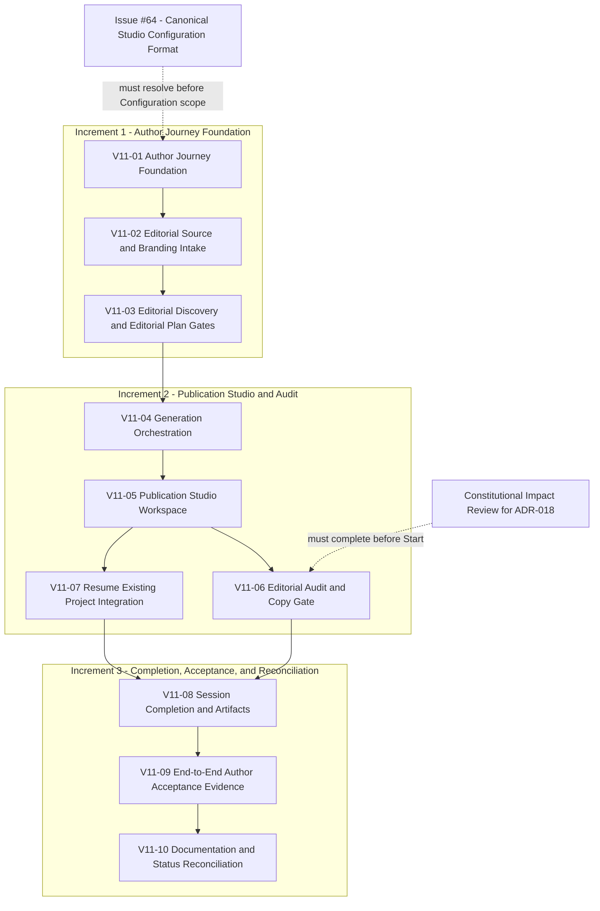

# Version 1.1 Engineering Epic

## Status

Proposed - pending engineering activation.

## 1. Executive Summary

This Epic operationalizes `docs/product/Version_1_1_Implementation_Plan.md`
into trackable, activatable engineering work. It does not change what that
plan approved.

The engineering objective is to activate, track, deliver, verify, and
close ten implementation slices (`V11-01` through `V11-10`), grouped into
three engineering increments - Author Journey Foundation (V11-01 through
V11-03), Publication Studio and Audit (V11-04 through V11-07), and
Completion, Acceptance, and Reconciliation (V11-08 through V11-10) -
without altering the increments, slice identifiers, dependencies, or
acceptance-criteria mapping the Implementation Plan already defines.

The governing implementation contract remains
`docs/product/Version_1_1_Implementation_Plan.md`, itself sequencing the
approved Version 1.1 Author Experience Baseline, State Machine, Acceptance
Criteria, ADR-018, and ADR-019. As of this Epic's creation, no Version 1.1
runtime implementation has begun: no slice has an open pull request, no
runtime module described in the Implementation Plan exists yet, and the
repository's 324-test baseline predates any Version 1.1 code.

This Epic is an execution and tracking layer only. It defines how the
already-approved slices become GitHub-tracked, Work-Order-delegated,
evidence-verified engineering work. It does not design product behavior,
does not implement runtime, and does not review architecture; those
activities remain governed by the documents this Epic cites, not by this
Epic itself.

## 2. Authority and Governing References

Controlling documents, in authority order for any conflict:

1. verified repository and GitHub state, for factual questions;
2. `docs/constitution/Constitution.md`;
3. `docs/constitution/Canonical_Vocabulary.md`;
4. `docs/architecture/adr/ADR-018-author-ownership-and-publication-studio.md`
   and
   `docs/architecture/adr/ADR-019-studio-configuration-and-author-controlled-continuity.md`,
   and the current architecture baseline;
5. `docs/architecture/Version_1_1_State_Machine.md`;
6. `docs/product/Version_1_1_Author_Experience_Baseline.md` and
   `docs/product/Version_1_1_Acceptance_Criteria.md`;
7. `docs/product/Version_1_1_Implementation_Plan.md`;
8. `docs/engineering/Capability_Delivery_Workflow.md` and `AGENTS.md`;
9. `docs/engineering/AI_Engineering_Standard.md` and
   `docs/engineering/AI_Engineering_Work_Order_Template.md`; and
10. this Epic.

The Implementation Plan governs sequencing and delivery scope: the ten
slices, their dependencies, their bootstrap and testing strategy, and
their acceptance-criteria mapping. The Baseline, State Machine, Acceptance
Criteria, ADR-018, and ADR-019 govern approved product behavior, the state
model, testable criteria, and the architectural decisions those criteria
enforce.

This Epic cannot change any of them. It sits below the Implementation Plan
in authority and adds nothing to what that plan already sequenced; it adds
only the operational mechanics - GitHub representation, work-order
delegation, and progress tracking - needed to execute it. Any discovery,
during this Epic's use, that approved product behavior, architecture, an
artifact boundary, a state transition, or a governance rule must change is
not resolved here. It returns to product design and Repository Author
review, exactly as
`docs/product/Version_1_1_Implementation_Plan.md` Section 4 and Section 19
already require.

## 3. Epic Objective

The Epic is complete when all ten Version 1.1 implementation slices have
reached the completion evidence the Implementation Plan defines for them,
the full Version 1.1 Acceptance Criteria set passes, and the governance
housekeeping the Implementation Plan's Definition of Done requires
(Section 20 there) is verified - without the underlying product
specification having changed and without Version 2 scope having entered
the repository.

The measurable outcome is not "Version 1.1 is released." It is "Version
1.1's approved implementation plan has been fully executed, verified, and
is ready for a separate release decision." See Section 18.

## 4. Scope

### In Scope

Operational activation and tracking of `V11-01` through `V11-10`:

- representing the ten slices and their governing increments in GitHub;
- issuing Engineering Work Orders for each slice or justified slice group;
- defining pull-request boundaries consistent with the Implementation
  Plan's bootstrap and Change Consolidation guidance;
- tracking validation and acceptance-criteria evidence per slice and per
  increment; and
- tracking the prerequisite gates (Issue #64, the ADR-018 Constitutional
  Impact Review) that bound specific slices' activation.

### Out of Scope

- Any product redesign or reinterpretation of the Author Experience
  Baseline, State Machine, or Acceptance Criteria.
- Automatic publishing of any kind.
- Publish to Platform, or any direct transmission of Publication Content
  to an external platform.
- Implementation of the Portable Author Context or any other Capability
  012 / Version 2 candidate.
- A standalone web, desktop, mobile, API, or hosted front-end
  implementation; the Article & Post Generator custom GPT remains the
  authorized initial interaction surface (Implementation Plan Section 19,
  Resolved - Interactive Surface).
- User accounts, persistent Author identity, or any hosted preference
  storage.
- Persistent storage beyond a single session's process lifetime.
- Multi-user collaboration or shared editing.
- Release authorization: tagging, `main` promotion, or GitHub Release
  publication. See Section 18.
- Any expansion of repository governance beyond what tracking this Epic's
  own execution requires.

## 5. Delivery Vocabulary

Seven terms recur through this Epic and must not be conflated:

- **Epic** - this document: the tracking and activation layer for the ten
  Version 1.1 implementation slices. Not a delivery profile, not itself
  mergeable code.
- **Engineering Increment** - one of the three delivery groupings defined
  by the Implementation Plan (Section 7 there): Increment 1, 2, or 3. A
  planning and reporting grouping, not an approval or delivery unit.
- **Implementation Slice** - one of `V11-01` through `V11-10`, the atomic
  engineering and traceability unit defined by the Implementation Plan
  (Section 8 there).
- **GitHub Issue** - a tracked unit of work in the repository's issue
  tracker; see Section 9 for how issues map to slices.
- **Pull Request** - a Git/GitHub artifact created under an authorized
  Publish delivery profile; see Section 10.
- **Delivery Profile** - Start, Publish, Complete, or Conservative, as
  defined in `AGENTS.md` and
  `docs/engineering/Capability_Delivery_Workflow.md`. This Epic introduces
  no new profile.
- **Release Milestone** - a Version 1.1 release decision, entirely
  separate from and downstream of Epic completion. See Section 18.

An implementation slice does not necessarily equal one pull request. A
single slice may require more than one pull request if its Start-profile
work is naturally divisible without violating the Implementation Plan's
"no silent scope expansion" rule; conversely, two adjacent slices may
share one pull request only under the Change Consolidation conditions
Section 10 states. Neither is decided in advance for every slice by this
Epic.

## 6. Engineering Increment Plan

### Increment 1 - Author Journey Foundation

**Objective.** Establish the orchestration foundation, intake gates, and
approval gates the entire Author Journey depends on: `V11-01`, `V11-02`,
`V11-03`.

**Included slices.** V11-01, V11-02, V11-03.

**Entry criteria.** Synchronized `develop`; the Implementation Plan, AI
Engineering Standard, and Work Order Template merged and available
(verified true as of this Epic; see Section 20); Issue #64 resolved for
the Configuration-serialization portion of `V11-01` (see Section 8).

**Exit criteria.** `V11-01` through `V11-03` each reach the completion
evidence the Implementation Plan defines for them (Section 8 there);
AC-ENTRY-1 through 3 and 8, AC-CONFIG-1 through 8 and 13 through 17,
AC-WORKFLOW-1 through 6, AC-SRC-1 through 4, AC-BRD-1 through 5,
AC-DISC-1 through 5, and AC-PLAN-1 through 4 all pass; the full existing
test suite remains green.

**Dependencies.** None beyond Issue #64's resolution for `V11-01`'s
Configuration scope; this increment is the foundation for Increment 2.

**Required evidence.** Per-slice completion evidence per the
Implementation Plan; the structural independence guard test between
Editorial Source and Branding (`V11-02`); the refinement-preserves-material
test (`V11-03`); full validation suite passing after each slice.

**Repository Author approval boundaries.** Start, Publish, and Complete
authorization for each of `V11-01`, `V11-02`, and `V11-03` individually,
per Section 10, unless a Repository Author decision explicitly
consolidates adjacent slices.

**Risks.** Foundation defects here compound into every later slice (see
Implementation Plan Section 8, `V11-01` Risks); Issue #64 resolving later
than expected delays this increment's start.

**Safe stopping conditions.** Any slice discovering a need to change
approved product behavior, per Section 12 of the Implementation Plan;
Issue #64 remaining unresolved; validation failure that cannot be repaired
within scope.

### Increment 2 - Publication Studio and Audit

**Objective.** Build Generation orchestration, the Publication Studio
workspace, the Editorial Audit and Copy LinkedIn Publication gate, and
Resume Existing Project integration: `V11-04`, `V11-05`, `V11-06`,
`V11-07`.

**Included slices.** V11-04, V11-05, V11-06, V11-07.

**Entry criteria.** Increment 1 exit criteria satisfied; for `V11-06`
specifically, a completed Constitutional Impact Review for ADR-018 (see
Section 8); `V11-04`, `V11-05`, and `V11-07` do not require that review to
begin.

**Exit criteria.** `V11-04` through `V11-07` each reach their defined
completion evidence; AC-GEN-1 through 7, AC-PSTUDIO-1 through 3,
AC-EDITOR-1 through 6, AC-CONTENT-1 through 4, AC-REVIEW-1 through 4,
AC-AUDIT-1 through 13, and AC-ENTRY-4 through 7 all pass; the full
existing test suite remains green; `studio/article_engine.py`'s hash pin
remains valid.

**Dependencies.** Increment 1 complete (`V11-03` specifically, for
`V11-04`'s Start); the ADR-018 Constitutional Impact Review, for `V11-06`
specifically only.

**Required evidence.** Per-slice completion evidence per the
Implementation Plan; the Generate Once structural test (`V11-04`); the
omit-if-absent content test (`V11-05`); the edit-audit-edit-audit sequence
test and the Configuration-reachability guard test (`V11-06`, `V11-07`).

**Repository Author approval boundaries.** Start, Publish, and Complete
authorization for each of `V11-04`, `V11-05`, `V11-06`, and `V11-07`
individually; `V11-06`'s Start additionally requires the Constitutional
Impact Review to be recorded complete before authorization is requested.

**Risks.** `V11-04` is the highest-leverage integration point in the
entire Epic (first place all Version 1.0 generation modules are chained);
`V11-06`'s Editorial Drift logic is the one genuinely new analytical
capability in the plan, with no existing runtime precedent.

**Safe stopping conditions.** The Constitutional Impact Review identifying
a conflict with the Constitution or an existing Decision Log entry (stops
`V11-06` only, not the rest of the increment); any specification-
preservation trigger per Section 12 of the Implementation Plan.

### Increment 3 - Completion, Acceptance, and Reconciliation

**Objective.** Finalize Session Completion and Session Artifacts,
demonstrate the complete Author Journey end to end, and reconcile
documentation and governance status: `V11-08`, `V11-09`, `V11-10`.

**Included slices.** V11-08, V11-09, V11-10.

**Entry criteria.** Increment 2 exit criteria satisfied (`V11-06` and
`V11-07` both complete, since `V11-08` depends on both).

**Exit criteria.** `V11-08` through `V11-10` each reach their defined
completion evidence; AC-CONFIG-9 through 12, AC-COMPLETE-1 through 5,
AC-LEAVE-1 through 3, and AC-XCUT-1 through 5 all pass; the complete
end-to-end Author Journey demonstration passes in both Guided and Express
Workflow, via both Entry Path branches; ADR-018 and ADR-019 status
transitions to Accepted are recorded only once justified.

**Dependencies.** Increment 2 complete.

**Required evidence.** Per-slice completion evidence per the
Implementation Plan; the live-edited-content-at-Complete test (`V11-08`);
the full Canonical Version 1.1 Session demonstration (`V11-09`); consistent
document status across all governing documents and the architecture
baseline (`V11-10`).

**Repository Author approval boundaries.** Start, Publish, and Complete
authorization for each of `V11-08`, `V11-09`, and `V11-10` individually;
Repository Author acceptance of the completed Epic itself, per Section 17.

**Risks.** `V11-09` is where cross-slice integration defects, as opposed
to within-slice defects, are most likely to surface; `V11-10` being
treated as optional or deferrable housekeeping rather than a required
governance step.

**Safe stopping conditions.** Any Acceptance Criterion found unmet at
`V11-09` is a defect in an earlier slice, reported and routed back to that
slice's owner, not patched at `V11-09`; `V11-10` does not proceed until
`V11-09` is fully green.

## 7. Slice Activation Register

Every slice below cites its governing Implementation Plan section for its
full Objective, Scope, Runtime changes, Test changes, Bootstrap impact,
Risks, and Completion evidence; those are not restated here. No slice
listed below has begun implementation as of this Epic's creation.

### V11-01 - Author Journey Foundation

- **Increment.** 1.
- **Objective.** Establish the orchestrating session object and implement
  Welcome, Entry Path, Studio Configuration Load, and Workflow Selection.
- **Governing Implementation Plan section.** Section 8, `V11-01`.
- **Dependencies.** None (foundation slice).
- **Required prerequisite decisions or reviews.** Issue #64 (Canonical
  Studio Configuration Format), for the Configuration schema, serialization,
  and load-time validation portion of this slice's scope specifically. See
  Section 8.
- **GitHub issue status.** Not created. See Section 9.
- **Delivery status.** Blocked by Prerequisite (Issue #64, for
  Configuration scope).
- **Expected evidence.** New tests for AC-ENTRY-1, 2, 3, 8 and AC-CONFIG-1
  through 8, 13 through 16 and AC-WORKFLOW-1, 2; full existing suite green;
  Configuration round-trip test passing.
- **Completion condition.** Per Implementation Plan Section 8, `V11-01`
  Completion evidence.
- **Explicit non-goals.** Does not implement Resume Validation's success
  path, Configuration generation, Editorial Source, or Branding.

### V11-02 - Editorial Source and Branding Intake

- **Increment.** 1.
- **Objective.** Implement Editorial Source and Branding as structurally
  independent states, including the Express Workflow's single permitted
  combination point.
- **Governing Implementation Plan section.** Section 8, `V11-02`.
- **Dependencies.** V11-01.
- **Required prerequisite decisions or reviews.** None beyond `V11-01`'s
  completion.
- **GitHub issue status.** Not created.
- **Delivery status.** Not Activated.
- **Expected evidence.** New tests for AC-SRC-1, 2; AC-BRD-1 through 5;
  AC-WORKFLOW-3 through 6; AC-CONFIG-17; the Source/Branding independence
  structural guard test.
- **Completion condition.** Per Implementation Plan Section 8, `V11-02`
  Completion evidence.
- **Explicit non-goals.** Does not implement Editorial Discovery's
  confirmation step or any generation.

### V11-03 - Editorial Discovery and Editorial Plan Gates

- **Increment.** 1.
- **Objective.** Implement the two sequential, non-mergeable approval
  gates between intake and Generation.
- **Governing Implementation Plan section.** Section 8, `V11-03`.
- **Dependencies.** V11-02.
- **Required prerequisite decisions or reviews.** None.
- **GitHub issue status.** Not created.
- **Delivery status.** Not Activated.
- **Expected evidence.** New tests for AC-SRC-3, 4; AC-DISC-1 through 5;
  AC-PLAN-1 through 4; the refinement-preserves-unrelated-material test.
- **Completion condition.** Per Implementation Plan Section 8, `V11-03`
  Completion evidence.
- **Explicit non-goals.** Does not perform Generation or handle
  blocked/failed outcomes.

### V11-04 - Generation Orchestration and Blocked/Failed Handling

- **Increment.** 2.
- **Objective.** Chain Evidence Validation, the Article Engine,
  Publication Package assembly, and the Hero Visual System into the
  single Generation step, with correct block/failure/success routing.
- **Governing Implementation Plan section.** Section 8, `V11-04`.
- **Dependencies.** V11-03.
- **Required prerequisite decisions or reviews.** None.
- **GitHub issue status.** Not created.
- **Delivery status.** Not Activated.
- **Expected evidence.** New tests for AC-GEN-1 through 7; the Generate
  Once structural test (a second Generation call is rejected or
  unreachable).
- **Completion condition.** Per Implementation Plan Section 8, `V11-04`
  Completion evidence.
- **Explicit non-goals.** Does not build Publication Studio; does not
  modify any existing generation module's internal risk or failure logic.

### V11-05 - Publication Studio Workspace

- **Increment.** 2.
- **Objective.** Build the composite Author Editing state: the
  two-workspace layout, the Publication Editor, the Publication Content
  boundary, the Editorial Review panel, and the Copy LinkedIn Publication
  action skeleton.
- **Governing Implementation Plan section.** Section 8, `V11-05`.
- **Dependencies.** V11-04.
- **Required prerequisite decisions or reviews.** None.
- **GitHub issue status.** Not created.
- **Delivery status.** Not Activated.
- **Expected evidence.** New tests for AC-PSTUDIO-1 through 3,
  AC-EDITOR-1 through 5, AC-CONTENT-1 through 4, AC-REVIEW-1 through 4; the
  no-rewrite/regenerate structural test; the omit-if-absent content test.
- **Completion condition.** Per Implementation Plan Section 8, `V11-05`
  Completion evidence.
- **Explicit non-goals.** Does not implement Editorial Audit or Resume
  Existing Project's entry point; AC-EDITOR-6's full gate enforcement
  completes in `V11-06`.

### V11-06 - Editorial Audit and the Copy LinkedIn Publication Gate

- **Increment.** 2.
- **Objective.** Implement Editorial Audit as an on-demand, analysis-only
  re-assessment, and complete the Copy LinkedIn Publication gate's
  matched/unmatched enforcement.
- **Governing Implementation Plan section.** Section 8, `V11-06`.
- **Dependencies.** V11-05.
- **Required prerequisite decisions or reviews.** A completed
  Constitutional Impact Review for ADR-018, required before this slice's
  Start. See Section 8.
- **GitHub issue status.** Not created.
- **Delivery status.** Blocked by Prerequisite (Constitutional Impact
  Review for ADR-018).
- **Expected evidence.** New tests for AC-AUDIT-1 through 13 and
  AC-EDITOR-6; the repeated-audit-with-intervening-edits test; the
  High-risk-leaves-content-unchanged test.
- **Completion condition.** Per Implementation Plan Section 8, `V11-06`
  Completion evidence.
- **Explicit non-goals.** Does not alter Evidence Validation's internal
  risk-derivation logic; does not implement Session Completion.

### V11-07 - Resume Existing Project Integration

- **Increment.** 2.
- **Objective.** Wire the existing, unmodified Portable Editorial Project
  resume mechanism into the Version 1.1 Entry Path as a distinct branch
  entering Publication Studio directly.
- **Governing Implementation Plan section.** Section 8, `V11-07`.
- **Dependencies.** V11-05 (independent of `V11-06`).
- **Required prerequisite decisions or reviews.** None.
- **GitHub issue status.** Not created.
- **Delivery status.** Not Activated.
- **Expected evidence.** New tests for AC-ENTRY-4 through 7; the
  Configuration-Load-unreachable-from-Resume structural test.
- **Completion condition.** Per Implementation Plan Section 8, `V11-07`
  Completion evidence.
- **Explicit non-goals.** Does not modify Portable Editorial Project
  validation, schema, or Temporal Integrity behavior.

### V11-08 - Session Completion, Configuration Generation, and Session Artifacts

- **Increment.** 3.
- **Objective.** Implement Session Completion's Configuration-generation
  prompt and finalize the three Session Artifacts.
- **Governing Implementation Plan section.** Section 8, `V11-08`.
- **Dependencies.** V11-06 and V11-07.
- **Required prerequisite decisions or reviews.** None beyond both
  dependencies' completion.
- **GitHub issue status.** Not created.
- **Delivery status.** Not Activated.
- **Expected evidence.** New tests for AC-CONFIG-9 through 12,
  AC-COMPLETE-1 through 5, AC-LEAVE-1 through 3; the
  edits-after-Generation-appear-at-Complete test.
- **Completion condition.** Per Implementation Plan Section 8, `V11-08`
  Completion evidence.
- **Explicit non-goals.** Does not implement any new persistence
  mechanism.

### V11-09 - End-to-End Author Acceptance Evidence

- **Increment.** 3.
- **Objective.** Produce a Canonical Version 1.1 Session demonstration
  exercising the complete Author Journey from Welcome to Complete, in both
  Guided and Express Workflow, via both Entry Path branches.
- **Governing Implementation Plan section.** Section 8, `V11-09`.
- **Dependencies.** V11-01 through V11-08, all complete.
- **Required prerequisite decisions or reviews.** None beyond all prior
  slices' completion.
- **GitHub issue status.** Not created.
- **Delivery status.** Not Activated.
- **Expected evidence.** Full Guided and Express Workflow sessions; full
  Resume Existing Project session; one blocked-Generation session; one
  Configuration round-trip across two sessions; confirmation of
  AC-XCUT-1 through 5 end to end.
- **Completion condition.** Per Implementation Plan Section 8, `V11-09`
  Completion evidence.
- **Explicit non-goals.** Implements no new feature; relaxes no unmet
  criterion.

### V11-10 - Documentation and Status Reconciliation

- **Increment.** 3.
- **Objective.** Bring every governing document, the architecture
  baseline, `ROADMAP.md`, `docs/VERSION_ONE_SCORECARD.md`, and
  `HANDOFF.md` into agreement with delivered reality.
- **Governing Implementation Plan section.** Section 8, `V11-10`.
- **Dependencies.** V11-09.
- **Required prerequisite decisions or reviews.** None beyond `V11-09`'s
  completion; the Constitutional Impact Review required for `V11-06` must
  already be complete by this point, since `V11-06` is a transitive
  dependency.
- **GitHub issue status.** Not created.
- **Delivery status.** Not Activated.
- **Expected evidence.** Consistent document status across all affected
  files; validation suite passing; no document referencing a
  still-Proposed decision as Accepted, or vice versa.
- **Completion condition.** Per Implementation Plan Section 8, `V11-10`
  Completion evidence.
- **Explicit non-goals.** Does not authorize release; does not touch
  `main`, tags, or GitHub Releases.

## 8. Prerequisite Register

### Issue #64 - Canonical Studio Configuration Format

- **Current state (verified).** Open, unresolved, at
  `https://github.com/RamrattanN/Ramrattan-AI-Editorial-Studio/issues/64`.
  It proposes adopting JSON as the sole canonical Ramrattan AI
  Configuration format, deprecating Markdown configuration input, and
  clarifying `docs/product/Version_1_1_Author_Experience_Baseline.md` and
  `docs/architecture/adr/ADR-019-studio-configuration-and-author-controlled-continuity.md`
  accordingly. As currently written, those two governing documents list
  both `.md` and `.json` as supported Configuration filename patterns
  without designating one as canonical - the exact ambiguity Issue #64
  exists to resolve.
- **Gating effect.** Must be resolved before implementation of
  Configuration serialization or loading behavior begins. This affects the
  Studio Configuration portion of `V11-01` specifically (Increment 1); it
  does not affect Entry Path routing or Workflow Selection's non-
  Configuration behavior.
- **Boundary.** Does not authorize field-level schema expansion beyond the
  two-field boundary ADR-019 already establishes (Workflow mode, Branding
  preference reference). Must be delivered as a focused documentation
  clarification to the two documents it names, not as a broader revision.
- **Current format status.** JSON remains proposed, not yet canonical,
  until Issue #64's clarification is merged into the governing documents.
  This Epic does not treat Issue #64 as resolved.

### Constitutional Impact Review for ADR-018

- **Requirement.** A completed Constitutional Impact Review under
  `docs/architecture/Definition_of_Done.md`, addressing ADR-018's
  "Governance Question Resolved" narrowing of Version 1.0's High/Severe
  publication-risk guarantee, together with the corresponding Version 1.0
  Decision Log entry ADR-018 itself identifies as required.
- **Gating effect.** Gates `V11-06` specifically (Editorial Audit and the
  matched-content Copy LinkedIn Publication gate), within Increment 2.
- **Boundary.** Does not block Increment 1. Does not block `V11-04`,
  `V11-05`, or `V11-07`, none of which depend on it.
- **Timing.** Must be completed before Start authorization for `V11-06`.
- **Safe stopping point.** Before any `V11-06` implementation begins; an
  incomplete or conflict-identifying review returns the matter to product
  design and Repository Author review rather than proceeding.
- **Current state.** Not yet performed. This Epic does not perform it.

### GPT Interaction-Surface Capability Verification

- **Decision in force.** The Article & Post Generator custom GPT is the
  initial Author-facing interaction surface (Implementation Plan Section
  19, Resolved - Interactive Surface). Repository-owned behavior -
  orchestration, state, prompts and interaction rules, validation - remains
  authoritative regardless of surface.
- **Requirement.** Any GPT platform capability a slice's implementation
  would depend on (Actions or function-calling, file handling, persistent
  memory, or any other integration mechanism) that is not verifiable from
  repository evidence must be confirmed before that slice relies on it.
  No such capability is currently confirmed by repository evidence; see
  Implementation Plan Section 6.
- **Boundary.** The absence of a specific GPT platform capability must not
  silently change approved product behavior. If a needed capability proves
  unavailable, that is a specification-preservation trigger (Section 12 of
  the Implementation Plan), not an implementation workaround to invent
  unilaterally.

### Legacy Workflow Protection

- **Decision in force.** `studio/workflow/` remains unchanged during
  Version 1.1 implementation and is treated as protected existing
  behavior (Implementation Plan Section 6 and Section 19, Settled - Legacy
  `studio/workflow/` module).
- **Boundary.** `scripts/bootstrap_sprint2_workflow.py` remains protected;
  no slice or bootstrap in this Epic's scope may modify it.
- **Future disposition.** Decided only after Version 1.1 delivery and
  validation, using implementation evidence gathered during that delivery,
  and requires its own explicit Repository Author authorization at that
  time. This Epic does not propose a disposition.

## 9. GitHub Issue Decomposition Plan

This section proposes how the Epic should later be represented in GitHub.
No issue, label, milestone, or Project item is created by this task.

**Verified GitHub metadata, as of this Epic's creation:**

- Existing labels: `bug`, `documentation`, `duplicate`, `enhancement`,
  `good first issue`, `help wanted`, `invalid`, `question`, `wontfix`. No
  Version-1.1-specific or capability-specific label exists.
- Existing milestones: one, "Version 0.9 - Constitutional Freeze"
  (milestone #1). No Version 1.1 milestone currently exists.
- Existing GitHub Project: "Ramrattan AI Editorial Studio" (open), with
  fields Title, Assignees, Status (`Todo` / `In Progress` / `Done`),
  Labels, Linked pull requests, Milestone, Repository, Reviewers, Parent
  issue, Sub-issues progress, Created, Updated, Closed.
- No existing Version 1.1 parent or epic-tracking issue was found by a
  repository-wide issue search; Issue #64 is the only currently open
  Version-1.1-related issue.

**Proposed decomposition:**

- **One parent Epic issue**, titled to match this document, summarizing
  the three increments and ten slices, and linking this file. Its Status
  begins at `Todo`.
- **One issue per implementation slice** (ten total: `V11-01` through
  `V11-10`), each referencing its governing Implementation Plan section
  and this Epic's Slice Activation Register entry, unless a Repository
  Author decision explicitly and narrowly justifies consolidating two
  adjacent slices into one issue for a stated scope, risk, or timing
  reason, per the Implementation Plan's Change Consolidation guidance.
- **Prerequisite references**, not new issues: Issue #64 is referenced
  from the `V11-01` issue as a blocking dependency; the Constitutional
  Impact Review is referenced from the `V11-06` issue the same way,
  recorded as text since the repository has no dedicated review-tracking
  issue type.
- **Dependency notation** using the Project's existing "Parent issue" and
  "Sub-issues progress" fields for the Epic-to-slice relationship, and
  explicit "Depends on #N" text references between slice issues for
  slice-to-slice dependencies, since no dedicated dependency field exists
  in the verified field list.
- **Acceptance-criteria references** as a checklist or explicit list
  inside each slice issue, drawn from this Epic's Slice Activation
  Register, not re-derived independently.
- **Project fields to use**: Status (`Todo` initially for every issue,
  `In Progress` and `Done` following existing repository convention),
  Milestone (left unset unless the Repository Author authorizes creating
  a Version 1.1 milestone, since none currently exists), Labels
  (`documentation` for `V11-01` through `V11-03`'s planning-adjacent
  scope and `V11-10`, `enhancement` for the runtime-bearing slices, as the
  closest existing matches - no new label is proposed).
- **No label, milestone, or Project field is invented.** If a Version 1.1
  milestone is desired, its creation is a separate, explicit GitHub
  mutation requiring its own authorization, not assumed here.

## 10. Pull Request Strategy

**Preferred concern boundaries.** One pull request per implementation
slice by default, matching the Implementation Plan's recommended
one-bootstrap-per-slice convention (Implementation Plan Section 15). A
slice's pull request contains that slice's runtime, tests, and
documentation changes together, per the Implementation Plan's
"documentation and tests move with runtime in the same slice" strategy
(Section 7 there).

**When multiple slices may share one pull request.** Only when a
Repository Author decision explicitly applies the Change Consolidation
conditions already governing this repository (`AGENTS.md`,
`CONTRIBUTING.md`): materially the same scope, the same risk profile, and
aligned delivery timing. Adjacent slices within the same increment are
the only realistic candidates; slices spanning two increments are not
consolidated.

**When slices must remain separate.** Whenever scope, risk, or approval
authority differs materially; whenever rollback or recovery is safer
separated; whenever delivery timing conflicts; or whenever an explicit
repository constraint requires it. `V11-06` is never consolidated with any
slice that does not also require the Constitutional Impact Review, since
doing so would tie an unrelated slice's Publish to that review's
completion.

**Protected and generated files.** No pull request in this Epic's scope
may modify `studio/article_engine.py` beyond calling it, `assets/brand/`
masters, or `scripts/bootstrap_sprint2_workflow.py` and the
`studio/workflow/` module it owns. A pull request that would require
modifying a hash-pinned or otherwise protected file, per Implementation
Plan Section 6, updates the owning test and documentation in the same
pull request rather than leaving them out of sync.

**Evidence required before Publish.** The slice's declared acceptance
criteria pass; the full existing validation suite
(`compileall`, `unittest discover`, `studio.py validate`, `git diff
--check`) passes; the staged diff matches exactly the slice's declared
scope, per Implementation Plan Section 16's staged-scope verification.

**Evidence required before Complete.** CI success on the pull request;
`mergeStateStatus: CLEAN` and `mergeable: MERGEABLE`; no unresolved review
gate; the merge commit verified to have the expected parentage after
merge.

**No unrelated cleanup.** A slice's pull request does not absorb an
adjacent slice's concern, does not touch `ROADMAP.md`,
`docs/VERSION_ONE_SCORECARD.md`, or `HANDOFF.md` except in `V11-10`
specifically, and does not perform housekeeping outside its declared
scope.

**No silent product changes.** Any pull request whose review reveals a
change to approved product behavior, architecture, an artifact boundary,
or a state transition stops before Publish and returns to product design
and Repository Author review, per Section 12 of the Implementation Plan
and Section 4 of this Epic.

## 11. Test and Validation Evidence by Increment

Test counts are not specified; each slice's test evidence is sized to its
acceptance-criteria group, matching the Implementation Plan's own
convention (Section 14 there). The table maps evidence categories to the
increment(s) that introduce them.

| Evidence category | Increment 1 | Increment 2 | Increment 3 |
|---|---|---|---|
| Unit tests (new modules) | V11-01, V11-02, V11-03 | V11-04, V11-05, V11-06, V11-07 | V11-08 |
| State-transition tests | V11-01 through V11-03 | V11-04 through V11-07 | V11-08 |
| Serialization/validation tests (Configuration) | V11-01 | - | - |
| Audit-gate tests | - | V11-05 (skeleton), V11-06 (full) | - |
| Resume tests | - | V11-07 | - |
| End-to-end tests | - | - | V11-09 |
| Deterministic bootstrap validation | Each slice's own bootstrap | Each slice's own bootstrap | Each slice's own bootstrap, and V11-10's ADR README bootstrap |
| Regression validation (existing 324 tests) | Every slice | Every slice | Every slice |
| `compileall` | Every slice | Every slice | Every slice |
| `unittest discover` | Every slice | Every slice | Every slice |
| `studio.py validate` | Every slice | Every slice | Every slice |
| `git diff --check` | Every slice | Every slice | Every slice |
| CI | Every pull request | Every pull request | Every pull request |
| Exact staged-scope verification | Every slice, before Publish | Every slice, before Publish | Every slice, before Publish |

This table does not add evidence requirements beyond what the
Implementation Plan already specifies per slice (Section 14 there); it
only organizes those requirements by increment for tracking purposes.

## 12. Architecture and Governance Gates

| Gate | Required when |
|---|---|
| Repository Author decision | A work order surfaces a genuine ambiguity in approved product, architecture, or governance behavior that this Epic and the Implementation Plan do not already resolve. |
| Constitutional Impact Review | Before Start authorization for `V11-06`, per Section 8. |
| ADR status transition (ADR-018, ADR-019) | Only at `V11-10`, and only once Version 1.1 is delivered against each decision, per each ADR's own stated condition. Neither transitions earlier. |
| Architecture baseline update | At `V11-10`, recording the delivered Version 1.1 runtime, following the existing baseline convention. |
| Targeted architecture review | If a slice's implementation surfaces a design question the Implementation Plan did not anticipate; scoped narrowly to that question, not a full re-review. |
| Specification-preservation stop | Any time approved product behavior, architecture, an artifact boundary, a state transition, governance, or an Author responsibility would otherwise change; see Section 12 of the Implementation Plan. |
| Conservative profile | Any work not covered by an explicitly authorized Start, Publish, or Complete profile, or any exceptional high-risk action. |
| Release authorization | Never triggered by this Epic; see Section 18. |

## 13. Work Order Strategy

Each slice, or a Repository-Author-approved consolidated group of
adjacent slices, is delegated through one holistic Engineering Work Order
built from
`docs/engineering/AI_Engineering_Work_Order_Template.md`, per
`docs/engineering/AI_Engineering_Standard.md`.

One coherent work order is preferred over a chain of patch instructions
when a slice's scope is already understood from its Implementation Plan
entry, matching the Standard's Core Principles. A work order for a slice
must include: its exact scope (the Implementation Plan's declared Scope
and Runtime changes for that slice), verified repository state at Start,
the exact validation commands and evidence required, explicit stop
conditions (including the specification-preservation rule), and the exact
approval boundary the work order authorizes.

Default functional roles apply per the AI Engineering Standard's
Multi-Agent Engineering Model:

- **Codex** is the default Lead Implementation Engineer role for slice
  runtime, test, and bootstrap work.
- **Claude** may perform bounded documentation, synthesis, or review
  work - for example, drafting or reviewing a slice's Work Order, or
  verifying a completed slice's evidence against its acceptance criteria.
- **ChatGPT** may support architecture, governance, and work-order design
  where a slice's scope needs product-architecture judgment before
  delegation.
- **GitHub Copilot** may support local implementation inside a slice
  already delegated to Codex.

These are operating defaults, not permanent authority grants, per the AI
Engineering Standard Section 7 and Section 8. Repository Author approval
remains controlling for every mutation regardless of which participant
performs the work; a participant's functional role never substitutes for
the approval profile a task requires.

## 14. Dependency and Critical Path



The critical path is Issue #64 -> `V11-01` -> `V11-02` -> `V11-03` ->
`V11-04` -> `V11-05` -> `V11-06` -> `V11-08` -> `V11-09` -> `V11-10`,
because `V11-06`'s Constitutional Impact Review gate and its downstream
position (both `V11-06` and `V11-07` feed `V11-08`) make it no faster than
the `V11-07` branch in the best case and strictly gating in the worst
case. `V11-07` is the one parallel opportunity the Implementation Plan
already permits: it depends only on `V11-05` and may proceed alongside
`V11-06` once `V11-05` completes, converging with it at `V11-08`. No other
slice has a parallel opportunity; every other edge is a hard sequential
dependency. Both `V11-08` and `V11-09` converge the entire Epic before
`V11-10` closes it.

## 15. Risk Register

| Risk | Severity | Trigger | Mitigation | Stop condition | Owner role |
|---|---|---|---|---|---|
| Implementation/specification drift | Critical | A slice resolves an ambiguity by changing approved behavior instead of escalating | Specification-preservation rule enforced per work order (Section 13) | Any detected drift, immediately | Repository Author |
| Audit-gate regression | Critical | `V11-06`'s matched/unmatched gate implemented as a UI convention instead of session-owned state | Structural gate test required in `V11-06`'s evidence (Section 11) | Gate test failing or absent | Lead Implementation Engineer |
| Configuration/project conflation | Major | A shared code path develops between Ramrattan AI Configuration and Portable Editorial Project | Structural guard tests in `V11-01` and `V11-07` (Section 7) | Guard test failing or absent | Lead Implementation Engineer |
| GPT platform-capability mismatch | Major | A slice assumes an unverified GPT capability (Actions, memory, file handling) | Explicit prerequisite confirmation before Start, per Section 8 | Capability confirmed unavailable after a slice assumed it | Repository Author |
| Protected-file/bootstrap coupling | Major | A slice needs to touch a hash-pinned or generated file without updating its owning test | Section 6 and Section 15 file inventory in the Implementation Plan | Hash-pin test failing after a change | Lead Implementation Engineer |
| Version 1 regression | Major | A change to `article_engine.py`, `hero_visual.py`, `evidence_validation.py`, or `portable_editorial_project.py`'s existing public behavior | Full existing 324-test suite rerun after every slice | Any existing test failing | Lead Implementation Engineer |
| Issue #64 unresolved past need | Major | `V11-01`'s Configuration scope begins before Issue #64 merges | Delivery status "Blocked by Prerequisite" enforced in Section 7 | Configuration work started while Issue #64 remains open | Repository Author |
| Issue/PR fragmentation | Moderate | Slices split into more issues or PRs than the Change Consolidation guidance supports | Section 9 and Section 10 default-to-one-per-slice rule | Issue count materially exceeds ten plus the parent Epic without a documented consolidation decision | Repository Author |
| Parallel-work collision | Moderate | Two work orders active on overlapping scope without a consolidation decision | Sequential-work default; disjoint-scope requirement for parallel work (AI Engineering Standard Section 17) | Overlapping in-progress work discovered | Repository Author |
| Token/resource inefficiency | Minor | Re-deriving already-established context for every slice's work order | This Epic and the Implementation Plan serving as the reusable per-slice reference | Repeated full-context re-reading without a material reason | Lead Implementation Engineer |
| Governance becoming an implementation bottleneck | Moderate | The Constitutional Impact Review or Issue #64 stall without a scheduled resolution | Section 19's recommended ordering places both early, ahead of Increment 1/2 dependent work | Either gate open more than one increment past its dependents being otherwise ready | Repository Author |
| Scope creep into Version 2 | Critical | A slice or its work order references Capability 012, Portable Author Context, or Publish to Platform as in-scope | Explicit Out of Scope list (Section 4) repeated at every slice's non-goals | Any Version 2 concept appearing as authorized scope in a work order or PR | Repository Author |

## 16. Epic Progress Model

Progress states, evidence-based, in order:

- **Proposed** - this Epic's current state; no slice activated.
- **Ready for Activation** - all Increment 1 entry criteria met and no
  slice remains Blocked by Prerequisite for its next required step.
- **Active** - at least one slice has an open, authorized work order.
- **Blocked** - the critical path's next required slice is Blocked by
  Prerequisite (Issue #64 or the Constitutional Impact Review) with no
  unblocked slice available to proceed on.
- **In Validation** - all ten slices have reached their individual
  completion evidence and `V11-09`'s end-to-end demonstration is running
  or complete.
- **Ready for Release Review** - `V11-10` complete, all governance
  housekeeping reconciled, and this Epic's own Definition of Done
  (Section 17) satisfied.
- **Complete** - Repository Author has accepted completion, per Section
  17.

This Epic's own status remains `Proposed - pending engineering
activation` as recorded above; this section defines the model for future
tracking and does not itself advance the status.

**Percentage complete** is calculated from the Version 1.1 Acceptance
Criteria set, not from subjective estimation:

```text
percent complete = (number of individual acceptance criteria with
passing, verified automated-test evidence / 99) x 100
```

The Version 1.1 Acceptance Criteria document
(`docs/product/Version_1_1_Acceptance_Criteria.md`) contains exactly 99
individual criteria across its sixteen groups (verified by direct count
at this Epic's creation: AC-ENTRY 8, AC-CONFIG 17, AC-WORKFLOW 6, AC-SRC
4, AC-BRD 5, AC-DISC 5, AC-PLAN 4, AC-GEN 7, AC-PSTUDIO 3, AC-EDITOR 6,
AC-CONTENT 4, AC-REVIEW 4, AC-AUDIT 13, AC-LEAVE 3, AC-COMPLETE 5,
AC-XCUT 5). This is a more precise unit than slice count, since slices
vary widely in how many criteria they cover; it is preferred over any
weighting that requires a subjective judgment of a slice's relative size
or difficulty.

## 17. Definition of Done

The Epic is complete only when:

- all ten slices meet the completion evidence the Implementation Plan
  defines for them (Section 8 there);
- all 99 Version 1.1 Acceptance Criteria pass;
- Issue #64, or an approved successor decision reached through the same
  documentation-clarification process, is resolved;
- the ADR-018 Constitutional Impact Review is complete;
- the complete end-to-end Author Journey demonstration (`V11-09`) passes;
- documentation and runtime are synchronized, per the Implementation
  Plan's Definition of Done (Section 20 there);
- ADR-018 and ADR-019 status transitions to Accepted occur, and only once
  each ADR's own stated delivery condition is satisfied;
- the architecture baseline is reconciled with a new revision recording
  the delivered Version 1.1 runtime;
- `compileall`, the full `unittest` suite, and `studio.py validate` all
  pass, with the pre-Version-1.1 test baseline unmodified in intent and
  still passing;
- no unresolved Critical or Major finding remains open against any
  governing Version 1.1 document or this Epic's own Risk Register;
- no unintended Version 2 scope - Portable Author Context, Publish to
  Platform, or any other `docs/product/version2/` candidate - is present
  anywhere in the delivered runtime or documentation; and
- the Repository Author explicitly accepts completion.

## 18. Release Boundary

Epic completion does not authorize release. Reaching every condition in
Section 17 makes Version 1.1 ready for a release decision; it does not
make that decision.

Tags, GitHub Releases, external publication, and `develop`-to-`main`
promotion each require their own, separate, explicit Repository Author
authorization, exactly as Version 1.0's release remained a distinct action
after RC1 readiness was reached. Version 1.1's release follows the same
repository release governance Version 1.0 used; this Epic does not modify
or shortcut that governance.

## 19. Recommended Immediate Next Actions

1. Deliver the Issue #64 documentation clarification as its own focused
   delivery, updating exactly the two documents it names.
2. Create or activate the parent Version 1.1 Epic issue in GitHub,
   referencing this document.
3. Create the ten slice issues from the decomposition in Section 9, using
   only verified existing labels, the existing Project Status field, and
   the Parent issue / Sub-issues progress relationship.
4. Begin Increment 1 with `V11-01`, once Issue #64 is resolved and its
   Delivery status in Section 7 is updated from Blocked by Prerequisite.
5. Schedule the ADR-018 Constitutional Impact Review well before `V11-06`
   is reached, so it does not become the critical-path bottleneck Section
   15 identifies as a risk.

None of these actions is executed by this task. They are recommendations
for separately authorized future work.

## 20. Implementation Readiness

**Ready with prerequisites.**

The governing Implementation Plan is complete, delivered, and merged to
`develop`; the AI Engineering Standard and Work Order Template needed to
delegate slice work are likewise delivered and merged. Every slice's
scope, dependencies, and acceptance-criteria mapping are fully defined
with no remaining ambiguity this Epic needed to resolve.

Two prerequisites currently block the critical path's first slice and one
downstream slice, both already identified by the Implementation Plan or
discovered since:

1. Issue #64 (Canonical Studio Configuration Format) is open and
   unresolved, blocking `V11-01`'s Configuration-serialization scope
   specifically - and therefore, since every later slice depends on
   `V11-01` transitively, blocking the practical start of Increment 1's
   Configuration-bearing work.
2. The Constitutional Impact Review for ADR-018 has not been performed,
   blocking `V11-06`'s Start specifically, within Increment 2.

Neither prerequisite requires revisiting this Epic, the Implementation
Plan, or any approved product decision. Both are governance acts this
Epic tracks but does not perform. No slice is currently in a Ready for
Activation state under the evidence-based Delivery status values recorded
in Section 7; resolving Issue #64 is the single action that unblocks the
Epic's actual starting point.
