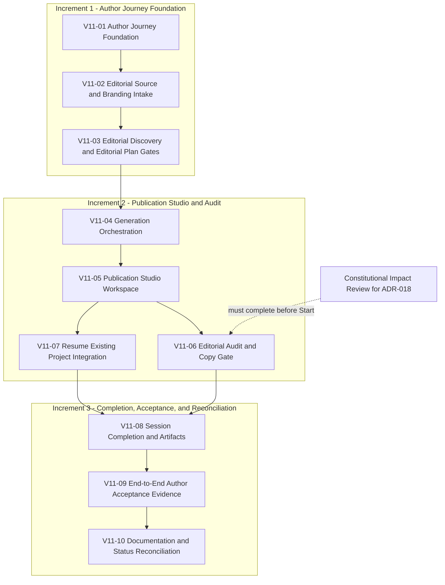

# Version 1.1 Implementation Plan

## Status

Proposed - pending implementation.

## 1. Executive Summary

This plan governs how the approved Version 1.1 Author Experience is delivered
into the runtime without changing what was approved. The governing
specification - the Author Experience Baseline, ADR-018, ADR-019, the State
Machine, the Acceptance Criteria, and the Design Rationale - is complete,
internally consistent, and treated here as fixed. This document adds nothing
to that specification. It sequences it.

The implementation goal is to build the Version 1.1 Author Journey as ten
bounded, independently traceable implementation slices (`V11-01` through
`V11-10`), each following the repository's existing Capability Delivery
Workflow, each leaving the repository in a clean, validated, documented
state, and each traceable to the specific Acceptance Criteria it satisfies.
No slice may introduce product behavior the governing documents did not
already approve.

Repository inspection (Section 6) confirms the Version 1.0 runtime already
supplies real, reusable building blocks for several Version 1.1 concerns -
Evidence Validation, LMHS Editorial Risk derivation, the Article Engine, the
Hero Visual System, and the Portable Editorial Project - and that the
"Generate Once" and "Author Owns the Message" guarantees ADR-018 requires are
already true of significant parts of the runtime today, largely because the
regeneration mechanism they prohibit (Component Collaboration) was never
actually built. What does not yet exist is any orchestration of these parts
into a single Author Journey, any Studio Configuration artifact, or any
repository-hosted interactive surface - the current runtime is a pure Python
library and CLI with no UI or API layer.

The Repository Author has since resolved the questions an earlier revision
of this plan left open. The initial Author-facing interaction surface is
the existing Article & Post Generator custom GPT, not a new standalone
application; the repository continues to own the complete implementation
contract - the Author Journey, state transitions, orchestration, prompts
and interaction rules, and every editorial and generative behavior - while
the GPT hosts presentation only. This continues
`docs/architecture/adr/ADR-001-the-workflow-is-the-product.md`'s founding,
Accepted decision to treat the guided workflow as the stable product layer
and AI-facing surfaces as replaceable, coordinated capabilities, and that
ADR's own deferral of "a complete interface" until the workflow itself was
validated. Implementation naming is fixed as the ten `V11-01` through
`V11-10` slice identifiers, never "Capability 012," which remains
associated with the unrelated Version 2 Portable Author Context candidate.
The ten slices are delivered through three coherent engineering increments
- Author Journey Foundation (V11-01 through V11-03), Publication Studio and
Audit (V11-04 through V11-07), and Completion, Acceptance, and
Reconciliation (V11-08 through V11-10) - which group delivery only and do
not alter any slice, dependency, or acceptance criterion. Finally, this
plan now states explicitly what it always assumed: if implementation
uncovers a need to change approved product behavior, architecture, artifact
boundaries, state transitions, governance, or Author responsibilities, work
stops and returns to product design and Repository Author review rather
than silently evolving the specification. The expected outcome remains a
fully orchestrated, fully tested Version 1.1 runtime, presented through the
existing custom GPT, that satisfies every criterion in
`docs/product/Version_1_1_Acceptance_Criteria.md`.

## 2. Purpose

This document governs the sequencing, boundaries, evidence requirements, and
delivery mechanics of Version 1.1 implementation work. It does not govern,
and must not be read as amending:

- product behavior, which remains defined exclusively by
  `docs/product/Version_1_1_Author_Experience_Baseline.md`;
- architecture decisions, which remain defined exclusively by ADR-018 and
  ADR-019;
- the state model, which remains defined exclusively by
  `docs/architecture/Version_1_1_State_Machine.md`;
- acceptance criteria, which remain defined exclusively by
  `docs/product/Version_1_1_Acceptance_Criteria.md`; or
- repository governance, delivery profiles, or approval boundaries, which
  remain defined exclusively by `AGENTS.md` and
  `docs/engineering/Capability_Delivery_Workflow.md`; or
- the interaction-surface decision (the Article & Post Generator custom
  GPT), which is recorded in this document at Repository Author direction
  and does not modify the Baseline's deliberate silence on UI mechanics.

Where this plan appears to describe product or architectural behavior, that
description is a restatement for sequencing purposes only. The governing
document controls in any conflict.

This document also records one governing implementation rule of its own:
Version 1.1 implementation shall preserve the approved product
specification. If implementation work uncovers a genuine need to change
approved product behavior, architecture, artifact boundaries, state
transitions, governance, or Author responsibilities, that work stops and
returns to product design and Repository Author review rather than
resolving the conflict unilaterally. Ordinary engineering decisions that do
not change approved behavior remain within the implementing agent's
authorized scope. See Section 4, Section 7, Section 17, Section 18,
Section 19, and Section 20.

This document does not authorize any implementation, branch creation, commit,
push, pull request, or GitHub mutation. It is read-only planning output.

## 3. Governing References

- `docs/product/Version_1_1_Author_Experience_Baseline.md` - canonical
  Author Journey specification.
- `docs/architecture/adr/ADR-018-author-ownership-and-publication-studio.md`
  - Author Ownership, Publication Studio, Branding independence, Editorial
  Audit Gate.
- `docs/architecture/adr/ADR-019-studio-configuration-and-author-controlled-continuity.md`
  - Studio Configuration content boundary and Resume Existing Project
  non-overlap.
- `docs/architecture/Version_1_1_State_Machine.md` - authoritative state
  model, transitions, and invariants.
- `docs/product/Version_1_1_Acceptance_Criteria.md` - testable criteria.
- `docs/product/Version_1_1_Design_Rationale.md` - informative reasoning,
  non-normative.
- `docs/constitution/Constitution.md` and
  `docs/constitution/Canonical_Vocabulary.md` - enduring principles and
  active terminology.
- `docs/engineering/Capability_Delivery_Workflow.md` and `AGENTS.md` -
  delivery sequence, approval boundaries, validation, and generated-file
  governance.
- `docs/architecture/baselines/Architecture_Baseline_2026.08.02v13.md` -
  current delivered architecture baseline.
- `HANDOFF.md` - current repository status and priorities.
- `docs/product/version2/Capability_012_Portable_Author_Context.md` -
  unapproved Version 2 candidate; boundary reference only.
- `docs/architecture/adr/ADR-001-the-workflow-is-the-product.md` - Accepted;
  establishes the workflow as the stable product layer and AI-facing
  surfaces, including the original Article & Post Generator, as
  replaceable, coordinated capabilities. Directly relevant to the
  interaction-surface decision recorded in Section 6 and Section 19.

This plan does not duplicate the content of these documents. Every product,
architecture, or governance claim below is a citation, not a restatement. No
repository document currently describes the Article & Post Generator custom
GPT's configuration or platform capabilities in the detail an implementer
would need; Section 6 records this explicitly rather than assuming it.

## 4. Implementation Principles

Each approved product principle translates into a concrete engineering
constraint for this delivery:

- **Trust Before Convenience -> No speculative shortcuts.** No slice may
  ship a partial gate, a temporarily permissive validation, or a "we will
  tighten this later" placeholder. A gate is either fully enforced or not yet
  built.
- **The Author Owns the Message -> No regeneration code, ever, anywhere.**
  No slice may add a method, endpoint, or control that rewrites, improves,
  shortens, or expands Publication Content after Generation. This is
  verified structurally (Section 14), not by convention.
- **Stateless by Design -> No new persistence.** No slice may introduce a
  database, session store, cache keyed by Author identity, or any mechanism
  that survives process exit other than the three explicitly approved,
  Author-delivered files.
- **Evidence Before Generation -> Gates are ordering constraints, not
  advisory copy.** Editorial Discovery and Editorial Plan approvals must be
  structurally required before Generation can execute, not merely
  recommended by a UI flow that could be bypassed by calling the underlying
  function directly.
- **Generate Once -> One orchestration entry point.** Generation must be
  implemented as a single function or method invoked at most once per
  session object's lifetime, enforced by the session's own state rather than
  by caller discipline.
- **Author Edits Freely -> No validation on edit content.** The Publication
  Editor's edit path must never reject, sanitize beyond safety-critical
  concerns, or evaluate Author edits. Evaluation happens only inside
  Editorial Audit, on request.
- **Audit Before Publishing -> The gate is a tracked boolean, not a UI
  hint.** "Matched" or "unmatched" must be state the session object owns and
  the Copy LinkedIn Publication action must read, not a client-side
  convention that a future integration could ignore.
- **Author-Controlled Continuity -> Configuration and Portable Editorial
  Project remain separate types with no shared code path.** No slice may
  introduce a function that accepts either interchangeably.
- **Progressive Disclosure -> State transitions are the enforcement
  mechanism.** A question is asked only when its state is entered; no slice
  may pre-compute or pre-request data for a later state.
- **One Decision Per Step -> One approval method per gate.** Editorial
  Discovery approval and Editorial Plan approval remain two distinct calls
  with two distinct preconditions, never a single combined approval flag.
- **Every Artifact Has One Responsibility -> Three artifact types, three
  modules, no shared serialization code that merges their schemas.**
- **Repository Owns the Contract; the GPT Hosts the Presentation.** The
  Article & Post Generator custom GPT is the Author-facing surface, but it
  is a presentation layer over a contract the repository defines and tests:
  Author Journey orchestration, state transitions, prompts and interaction
  rules, editorial and generative behavior, and validation all remain
  repository-owned. No slice may place product logic, gating, or validation
  exclusively inside the GPT where the repository cannot verify it.
- **Specification Preservation Is Non-Negotiable.** No slice may resolve an
  implementation ambiguity by silently changing approved product behavior,
  architecture, artifact boundaries, state transitions, governance, or
  Author responsibilities. Where a genuine conflict or gap is discovered,
  the slice stops and returns to product design and Repository Author
  review before proceeding. Ordinary engineering choices that do not change
  approved behavior are not subject to this rule. See Section 17, Section
  18, Section 19, and Section 20.

## 5. Scope

### In Scope

- The complete Version 1.1 Author Journey runtime: Welcome, Entry Path,
  Studio Configuration (load and generate), Workflow Selection, Editorial
  Source, Branding, Editorial Discovery, Editorial Plan, Generation
  orchestration and its blocked/failed handling, Publication Studio (Author
  Editing and Editorial Audit), Session Completion, and Complete.
- The Ramrattan AI Configuration artifact: schema, filename convention,
  serialization, and validation, following the precedent already established
  by the Portable Editorial Project.
- Integration of the existing, unmodified Portable Editorial Project resume
  path into the Version 1.1 Entry Path as a distinct branch.
- The Copy LinkedIn Publication gate (matched/unmatched tracking) as
  session-owned state.
- Test coverage, documentation updates, and bootstrap ownership for every
  runtime change made under this plan.
- End-to-end Author acceptance evidence demonstrating the complete Journey,
  analogous in kind to the existing Version 1.0 end-to-end demonstration.
- Delivery of the repository-owned implementation contract described above
  through the existing Article & Post Generator custom GPT as the initial
  Author-facing interaction surface, including the prompts and interaction
  rules that surface presents (Section 6, Section 19).

### Out of Scope

- Automatic publishing of any kind.
- Publish to Platform, or any direct transmission of Publication Content to
  LinkedIn or any other external platform.
- Implementation of the Portable Author Context described in
  `docs/product/version2/Capability_012_Portable_Author_Context.md`.
- Any other Capability 012 candidate or Version 2 architecture work.
- User accounts, authentication, or persistent Author identity.
- Server-side profiles or hosted preference storage of any kind.
- Persistent storage of any Author data beyond a single session's process
  lifetime.
- Multi-user collaboration or shared editing.
- Unrelated UI or platform work not required to render the Version 1.1
  Author Journey.
- Any redesign of the approved Version 1.1 product specification.
- Any Version 2 architecture decision.
- Modification of `studio/article_engine.py` beyond what is required to call
  it as an orchestrated step (it is hash-pinned; see Section 6 and Section
  15).
- Modification of approved brand masters under `assets/brand/`.
- A standalone web application, desktop application, mobile application,
  new UI framework, new API product, or separate hosted front end for
  Version 1.1. Any future standalone platform remains outside Version 1.1
  and requires its own review (Section 19).
- Modification, deprecation, or refactor of the legacy `studio/workflow/`
  module or its owning bootstrap. Its disposition is decided only after
  Version 1.1 delivery and validation, using implementation evidence; it is
  treated as protected existing behavior throughout this plan (Section 6,
  Section 19).

## 6. Current-State Assessment

Findings below are grounded in direct repository inspection performed for
this plan. Each is evidence, not inference, unless explicitly marked as an
assumption.

### Reusable Version 1.0 runtime seams

- `studio/evidence_validation.py` implements `ClaimClassification`,
  `EditorialRisk` (the LMHS scale), `EditorialConfidence`,
  `EvidenceValidator.assess()`, `EditorialRiskReviewer.review()`, and the
  pipeline entry point `validate_evidence()`. This is the existing Editorial
  Integrity Pipeline and is reusable, unmodified, as both the Generation-time
  risk check and the re-assessment engine Editorial Audit's LMHS Assessment
  requires.
- `studio/article_engine.py` (`ArticleEngine.create_article()`) and
  `studio/publication_package.py` (`PublicationPackageBuilder.build()`) each
  independently refuse to produce output under High or Severe Editorial
  Risk. This is the exact structural enforcement ADR-018's "Governance
  Question Resolved" section cites as Version 1.0's existing guarantee.
  `studio/article_engine.py` is hash-pinned (Section 15); it must be called,
  not edited.
- `studio/hero_visual.py` (`HeroVisualSystem.generate()`) is a single-call,
  provider-independent generator with an explicit `HeroVisualStatus` failure
  taxonomy (`READY, GENERATION_FAILED, VALIDATION_FAILED,
  UNSUPPORTED_PROVIDER, MALFORMED_REQUEST, BLOCKED`) already suited to the
  "blocked or failed" outcome the Baseline's Editorial Plan section requires.
- `studio/portable_editorial_project.py` (`resume_project()`) already
  validates a Portable Editorial Project, enforces Temporal Integrity
  review, and calls `EditorialSession.resume()` - this is the complete,
  unmodified mechanism the Resume Existing Project entry path is specified
  to reuse rather than redefine.

### Existing state/session capabilities

- `studio/editorial_discernment.py` defines the current canonical
  `EditorialSession` (fields `intent`, `workspace_state`, `stage_states`,
  `approved_components`, `preserved_events`) with lifecycle methods
  `activate()`, `pause()`, `resume()`, `cancel()`, `abort()`, `complete()`,
  `archive()`. `WorkspaceState` (`CREATED, ACTIVE, WAITING_FOR_AUTHOR,
  PAUSED, CANCELLED, ABORTED, COMPLETED, ARCHIVED`) and `StageState`
  (`NOT_STARTED, IN_PROGRESS, COMPLETE, BLOCKED`, from
  `studio/editorial_guidance.py`) are the two existing lifecycle vocabularies
  and are formally distinct per `Canonical_Vocabulary.md`.
- A second, unrelated legacy module, `studio/workflow/` (`WorkflowStage`
  IntEnum: `START` through `COMPLETE`, carousel-oriented), is a superseded
  Sprint 2 prototype built under
  `docs/architecture/adr/ADR-001-the-workflow-is-the-product.md`'s
  still-Accepted principle that the workflow is the stable product layer.
  `tests/test_article_first_alignment.py` explicitly labels its concepts
  historical. It is not a candidate foundation for Version 1.1's Workflow
  Selection and must not be confused with it merely because both use the
  word "workflow." Per Repository Author direction, this plan treats the
  module and its owning bootstrap
  (`scripts/bootstrap_sprint2_workflow.py`) as protected, unchanged
  existing behavior for the duration of Version 1.1 implementation; its
  disposition is a decision for after Version 1.1 delivery and validation,
  informed by implementation evidence, not for this plan or this delivery.
  See Section 19.
- No existing class represents "the Author Journey" as a single orchestrated
  sequence. `EditorialSession`, `EvidenceValidator`, `ArticleEngine`,
  `PublicationPackageBuilder`, and `HeroVisualSystem` are currently invoked
  independently by callers (tests) rather than chained by any runtime
  orchestrator. Version 1.1 must build this orchestration; it does not exist
  today.

### Existing Portable Editorial Project behavior

`studio/portable_editorial_project.py` provides schema-versioned validation
(`_validate_project()`), Markdown/JSON serialization with an embedded fenced
JSON block, a versioned filename convention
(`{prefix}_{slug}_{YYYY.MM.DDvNN}{suffix}`, sequential `v01`-`v99` per day),
deterministic ZIP export, and the `resume_project()` function described
above. This is the direct precedent Studio Configuration's file format and
naming convention are specified to follow (ADR-019), and this plan treats it
as the reference implementation pattern for the new Configuration module
(Section 15).

### Existing LMHS and evidence-validation capabilities

Covered above under "Reusable Version 1.0 runtime seams." No changes to this
pipeline's internal logic are in scope (Section 5); Version 1.1 only adds a
second caller (Editorial Audit) invoking the same `validate_evidence()`
pipeline against edited content.

### Existing Publication Package and Hero Visual behavior

`PublicationPackageBuilder` has exactly three public methods - `build()`,
`attach_hero_visual()`, `attach_portable_editorial_project()` - and none of
them, nor any method anywhere in `studio/hero_visual.py` or
`studio/article_engine.py`, regenerates or mutates existing output. Both
`attach_hero_visual()` and `attach_portable_editorial_project()` explicitly
refuse to run a second time. This confirms Generate Once is already a
structural property of the underlying generation modules; Version 1.1's
Publication Studio must not weaken it by adding a new call path that
bypasses these single-use guards.

### Existing tests and bootstrap ownership constraints

25 test files exist under `tests/`, following a one-file-per-capability-or-
concern convention (for example `test_capability010_hero_visual.py`,
`test_capability011_portable_editorial_project.py`). No test file for any
Version 1.1 concept exists yet. 24 bootstrap and helper scripts exist under
`scripts/`, most following a one-bootstrap-per-capability naming convention
(a minority use event- or sprint-based names instead; see Section 15) with
preview-by-default, `--apply`-writes semantics, and self-integrity checks.
Section 15 details ownership implications for Version 1.1.

### Files or modules that are hash-pinned or otherwise protected

- `studio/article_engine.py` is pinned by exact SHA-256 digest in
  `tests/test_rc1_checkpoint.py` and `tests/test_capability010_documentation.py`.
  It must be treated as read-only by every Version 1.1 slice; orchestration
  code must call it, not modify it.
- Brand master assets under `assets/brand/` are hash-pinned in three
  independent locations (`tests/test_rc1_checkpoint.py`,
  `tests/test_b001_brand_assets.py`, `scripts/bootstrap_b001_brand_identity.py`).
  They are out of scope (Section 5) and unrelated to Version 1.1's Branding
  stage, which concerns Author-supplied publication branding, not the
  Studio's own product identity.
- `docs/architecture/adr/README.md`, `HANDOFF.md`, `ROADMAP.md`, and
  `docs/VERSION_ONE_SCORECARD.md` are protected only by substring
  (`assertIn`) checks where checked at all, not full-hash pinning.
  `evidence_validation.py`, `hero_visual.py`, `publication_package.py`,
  `editorial_discernment.py`, and `portable_editorial_project.py` are not
  hash-pinned by any existing test. This means Version 1.1 orchestration
  code may call into these modules without triggering a hash-pin failure,
  but any slice that needs to modify one of them (as opposed to calling it)
  must update the relevant test and documentation in that same slice per
  `AGENTS.md`'s Generated Files governance.

### Interactive surface: the custom GPT

Per Repository Author decision, the initial Author-facing implementation
surface for Version 1.1 is the existing Article & Post Generator custom
GPT, not a new standalone application.
`docs/architecture/adr/ADR-001-the-workflow-is-the-product.md` (Accepted)
already establishes the relevant precedent: it names "the original Article
& Post Generator" as the single-instruction-set predecessor this
repository's workflow-first architecture was built to discipline, treats AI
models, prompts, visual generators, and publishing adapters as replaceable
capabilities the workflow coordinates rather than the reverse, and
explicitly defers "a complete interface" until the workflow itself is
validated. Using the custom GPT as Version 1.1's surface is consistent
with, not a departure from, that decision - it is the workflow-first
architecture accepting its first AI-facing presentation layer.

No repository evidence describes the custom GPT's current configuration or
platform capabilities - whether it supports Actions or function-calling
into repository-hosted code, file upload or retrieval, persistent memory
between turns, or any other integration mechanism. This plan does not
assume any specific capability. Where a slice's implementation would
require one, that requirement is an explicit implementation prerequisite to
confirm before that slice's Start, not an assumption made in this plan (see
each affected slice's Dependencies in Section 8, and Section 19).

The repository continues to own the complete implementation contract
regardless of surface: the Author Journey, state transitions, orchestration,
prompts and interaction rules, Editorial Source and Branding handling,
Editorial Discovery, Editorial Plan, Publication Package and Hero Visual
generation, Publication Studio behavior, the Author-editable Publication
Editor's rules, Editorial Review, Editorial Audit, the matched-content Copy
LinkedIn Publication gate, Studio Configuration, the Portable Editorial
Project and its resume behavior, deterministic validation, and every test
and delivery-evidence artifact. The GPT hosts presentation of that contract;
it does not own or redefine any part of it.

### Known gaps between current runtime and Version 1.1 requirements

No runtime code exists today for: Welcome (beyond a greeting string),
Entry Path, Studio Configuration, Workflow Selection (Guided/Express),
Branding as a distinct guarded state, Editorial Discovery, Publication
Studio, Author Editing's Copy-gate, Editorial Audit as a distinct
re-assessment action, or Session Completion. No interactive surface hosted
by the repository itself (web, CLI beyond the four administrative
subcommands in `studio.py`, or API) exists, and none is being built - the
Article & Post Generator custom GPT, external to this repository, is the
designated Author-facing surface (see Interactive surface: the custom GPT,
above). This is the central sizing fact for this plan: Version 1.1 is
not a modification of an existing session flow, it is the first
implementation of one, assembled from already-proven, already-tested
components.

## 7. Implementation Strategy

**Delivery vocabulary.** Five distinct terms recur throughout this plan and
must not be conflated:

- an **implementation slice** (`V11-01` through `V11-10`) is the atomic
  engineering and traceability unit defined in Section 8;
- an **engineering increment** (Increment 1, 2, or 3, defined below) is a
  delivery grouping of slices, for planning and reporting visibility only;
- a **delivery profile** (Start, Publish, Complete, or Conservative) is the
  `AGENTS.md` approval mechanism applied to a unit of work;
- a **pull request** is a Git/GitHub artifact created under a Publish
  profile; and
- a **release milestone** is a Version 1.1 release decision, governed by
  Section 21, entirely separate from and downstream of all of the above.

An engineering increment does not imply one pull request per slice or one
pull request per increment; that granularity is a delivery-profile decision
made at Start authorization time (Section 17), not a property of the
increment grouping itself.

**Engineering increments.** The ten slices are delivered through three
coherent increments:

- **Increment 1 - Author Journey Foundation:** V11-01, V11-02, V11-03.
- **Increment 2 - Publication Studio and Audit:** V11-04, V11-05, V11-06,
  V11-07.
- **Increment 3 - Completion, Acceptance, and Reconciliation:** V11-08,
  V11-09, V11-10.

These groupings organize delivery visibility and reporting only. They do
not replace the ten slice identifiers, merge any slice's acceptance
criteria, erase any dependency recorded in Section 9, or authorize
implementation of any slice within them.

- **Incremental slices, one coherent concern each.** Each slice in Section 8
  is scoped to one segment of the Author Journey with one clear entry and
  exit condition, matching the granularity the State Machine already
  defines.
- **Dependency order follows the Author Journey itself.** Because the
  Journey is a single directed sequence with two re-entrant loops (Discovery
  refinement, Plan revision) and one branch (Entry Path), slice order follows
  state order; see Section 9.
- **Deterministic bootstrap ownership.** Every slice that adds or changes a
  generated or managed file identifies its owning bootstrap before writing
  to that file, per `AGENTS.md`'s Generated Files governance. See Section
  15.
- **No silent scope expansion.** A slice implements only the states,
  transitions, and criteria assigned to it in Section 11. A slice that
  discovers a need to touch another slice's concern stops and reports the
  overlap rather than absorbing it.
- **Documentation and tests move with runtime in the same slice.** No
  slice merges runtime code without the test file(s) and documentation
  updates that prove it satisfies its assigned acceptance criteria.
- **Acceptance criteria are the definition of "done" for a slice**, not
  code review judgment alone. Section 11's matrix is the checklist each
  slice's completion evidence must satisfy.
- **Specification preservation governs every slice.** If a slice's
  implementation surfaces a genuine need to change approved product
  behavior, architecture, artifact boundaries, state transitions,
  governance, or Author responsibilities, that slice stops and returns to
  product design and Repository Author review rather than resolving the
  conflict unilaterally. This applies to product-specification conflicts
  only; ordinary engineering choices that do not change approved behavior
  remain within the implementing agent's authorized scope. See Section 19.

## 8. Implementation Slices

Each slice below is a repository-owned engineering unit. Where a slice's
description refers to what the Author "sees" or what is "presented" -
language already used in `docs/architecture/Version_1_1_State_Machine.md`
- that presentation occurs through the Article & Post Generator custom GPT
(Section 6); the slice itself implements only the repository-owned
contract - state, orchestration, content, and validation - that the GPT's
prompts and interaction rules must follow. The "(Increment N)" label on
each heading below is the delivery grouping defined in Section 7 and does
not alter that slice's scope, dependencies, or acceptance criteria.

### V11-01 - Author Journey Foundation (Increment 1)

**Objective.** Establish the orchestrating session object for the Version
1.1 Author Journey and implement its earliest states: Welcome, Entry Path,
Studio Configuration Load, and Workflow Selection.

**Scope.** New orchestration module wrapping (not replacing) the existing
`EditorialSession`. Entry Path branch logic (routes to Configuration Load or
to Resume Validation, the latter deferred to V11-07's full integration but
stubbed here as a routing target). Ramrattan AI Configuration schema,
serialization, filename convention, and load-time validation, modeled
directly on `portable_editorial_project.py`'s pattern. Workflow Selection
state (Guided/Express) as session-owned data, with Configuration-sourced
pre-selection.

**Runtime changes.** New module, tentatively `studio/author_journey.py` or
`studio/studio_configuration.py` plus a session orchestrator (naming is an
implementation detail, not a product decision). No changes to
`article_engine.py`, `hero_visual.py`, `evidence_validation.py`,
`publication_package.py`, or `portable_editorial_project.py`.

**Documentation changes.** New test-mapped documentation entry under the
existing `docs/` convention for the new module; no changes to the six
governing Version 1.1 documents.

**Test changes.** New test file(s) covering: Entry Path presentation and
routing (AC-ENTRY-1, 2, 3, 8), Configuration load/reject/restore behavior
(AC-CONFIG-1 through 8, 13 through 16), and Workflow Selection presentation
(AC-WORKFLOW-1, 2).

**Bootstrap/generator impact.** A dedicated bootstrap, named from this
slice's `V11-01` identifier (for example
`bootstrap_v11_01_author_journey_foundation.py`), per Section 15's
recommended one-bootstrap-per-slice convention. No capability number is
required or used.

**Dependencies.** None. This is the foundation slice.

**Acceptance criteria covered.** AC-ENTRY-1, 2, 3, 8; AC-CONFIG-1 through 8,
13 through 16; AC-WORKFLOW-1, 2.

**Explicit non-goals.** Does not implement Resume Validation's success path
into Publication Studio (V11-07). Does not implement Configuration
generation (V11-08). Does not implement Editorial Source or Branding.

**Risks.** Establishes the orchestration pattern every later slice extends;
a poor foundation here compounds. Mitigate by keeping the orchestrator thin
and delegating all editorial logic to existing modules.

**Expected repository areas.** `studio/`, `tests/`, `scripts/` (new
bootstrap).

**Completion evidence.** New tests pass; full existing suite (324 tests as
of this plan's writing) remains green; `python3 studio.py validate` passes;
Configuration round-trip (generate then load) produces an identical
two-field result.

### V11-02 - Editorial Source and Branding Intake (Increment 1)

**Objective.** Implement Editorial Source and Branding as two structurally
independent states, including the Express Workflow's single permitted
combination point.

**Scope.** Editorial Source intake and inference presentation. Branding
intake with Studio Theme default. The structural no-data-path guard between
the two (Section 4). Express Workflow's combined-screen behavior as a
presentation-layer concern only. Configuration-carried Branding preference
shown for confirmation, not silently applied.

**Runtime changes.** New state-handling code in the orchestrator from
V11-01. No changes to `hero_visual.py`'s existing branding-adjacent policy
flags (`allow_logo`, `brand_context`), which remain the Hero Visual System's
own concern and are consumed, not duplicated.

**Documentation changes.** None to governing documents.

**Test changes.** New tests for AC-SRC-1, 2; AC-BRD-1 through 5;
AC-WORKFLOW-3, 4, 5, 6; AC-CONFIG-17. Must include a structural test
asserting no code path passes Editorial Source data into the Branding
handler or vice versa (mirroring the existing pattern of structural
prohibition tests, such as the forbidden `component_collaboration.py`
module test).

**Bootstrap/generator impact.** A dedicated bootstrap, named from this
slice's `V11-02` identifier, per Section 15's recommended
one-bootstrap-per-slice convention.

**Dependencies.** V11-01.

**Acceptance criteria covered.** AC-SRC-1, 2; AC-BRD-1 through 5;
AC-WORKFLOW-3 through 6; AC-CONFIG-17.

**Explicit non-goals.** Does not implement Editorial Discovery's
confirmation step (AC-SRC-3, 4 are covered there and in Generation). Does
not perform any generation.

**Risks.** The independence guard is the highest-value structural test in
this slice; a false pass here (a guard that looks correct but has a
reachable back-channel) would silently violate ADR-018 rule 3. Mitigate with
an explicit test that constructs Editorial Source data containing a marker
value and asserts it is absent from every Branding-path output.

**Expected repository areas.** `studio/`, `tests/`.

**Completion evidence.** New tests pass; independence guard test passes;
full suite remains green.

### V11-03 - Editorial Discovery and Editorial Plan Gates (Increment 1)

**Objective.** Implement the two sequential, non-mergeable approval gates
between intake and Generation.

**Scope.** Editorial Discovery: presentation of confirmed intent, audience,
platform, outcome, and Branding decision as one reviewable understanding;
refinement branches back to Editorial Source or Branding without data loss.
Editorial Plan: Headline/Hook/Key Insights/Practical Takeaway/CTA proposal;
approve-or-revise loop; no Generation without approval.

**Runtime changes.** New state-handling code. May reuse
`ArticleRequest`/`ArticleDraft`-shaped data from `article_engine.py` for the
Plan's structure, but does not call `create_article()` yet - that begins
only in V11-04's Generation orchestration, since Editorial Plan approval
must precede Generation, not trigger it directly from within the Plan
state.

**Documentation changes.** None to governing documents.

**Test changes.** New tests for AC-SRC-3, 4; AC-DISC-1 through 5; AC-PLAN-1
through 4.

**Bootstrap/generator impact.** A dedicated bootstrap, named from this
slice's `V11-03` identifier, per Section 15's recommended
one-bootstrap-per-slice convention.

**Dependencies.** V11-02.

**Acceptance criteria covered.** AC-SRC-3, 4; AC-DISC-1 through 5; AC-PLAN-1
through 4.

**Explicit non-goals.** Does not perform Generation. Does not handle
blocked/failed outcomes (V11-04).

**Risks.** Refinement branches (AC-DISC-3, 4) must preserve unrelated
previously-supplied material exactly; a naive implementation that resets
the whole intake on refinement would violate these criteria while appearing
to work in the simple case. Mitigate with a test that supplies both
Editorial Source and Branding, refines only one, and asserts the other is
byte-identical afterward.

**Expected repository areas.** `studio/`, `tests/`.

**Completion evidence.** New tests pass; full suite remains green.

### V11-04 - Generation Orchestration and Blocked/Failed Handling (Increment 2)

**Objective.** Chain the existing, individually-tested Evidence Validation,
Article Engine, Publication Package, and Hero Visual modules into the single
Generation step the Baseline specifies, with correct routing on block,
failure, or success.

**Scope.** One orchestration function/method: approved Plan in, either a
transition to Publication Studio (success) or a return to Editorial Plan
with an explicit block/failure explanation (AC-GEN-5, 6). Enforces AC-GEN-1
(Publication Studio entered at most once), AC-GEN-7 (blocked/failed attempts
do not count toward that limit).

**Runtime changes.** New orchestration code only. `article_engine.py`
(hash-pinned, called only), `hero_visual.py`, `evidence_validation.py`, and
`publication_package.py` are called as-is, in their existing sequence:
`validate_evidence()` -> `ArticleEngine.create_article()` ->
`PublicationPackageBuilder.build()` -> `HeroVisualSystem.generate()` ->
`PublicationPackageBuilder.attach_hero_visual()`.

**Documentation changes.** None to governing documents.

**Test changes.** New tests for AC-GEN-1 through 7. Must include a test that
attempts to call the orchestrator's Generation entry point a second time
within the same session object and asserts it is rejected or is
structurally unreachable, directly verifying Generate Once.

**Bootstrap/generator impact.** A dedicated bootstrap, named from this
slice's `V11-04` identifier, per Section 15's recommended
one-bootstrap-per-slice convention.

**Dependencies.** V11-03.

**Acceptance criteria covered.** AC-GEN-1 through 7.

**Explicit non-goals.** Does not build Publication Studio itself (V11-05).
Does not modify any existing generation module's internal risk or failure
logic.

**Risks.** This slice is the highest-leverage integration point in the
plan - it is the first place all of Version 1.0's generation modules are
called together. A misordering (for example, attaching a Hero Visual before
confirming the article build succeeded) could produce a package in an
invalid intermediate state. Mitigate by preserving the exact call order
already implied by `PublicationPackageBuilder`'s own method preconditions
(`build()` before `attach_hero_visual()` before
`attach_portable_editorial_project()`), which the builder already enforces
structurally.

**Expected repository areas.** `studio/`, `tests/`.

**Completion evidence.** New tests pass; a successful end-to-end Generation
call produces a `PublicationPackage` with a Hero Visual attached; a
High/Severe-risk Plan is blocked without producing any package; full suite
remains green.

### V11-05 - Publication Studio Workspace (Increment 2)

**Objective.** Build the composite Author Editing state: the two-workspace
layout, the fully Author-editable Publication Editor, the Publication
Content boundary, the Editorial Review panel, and the Copy LinkedIn
Publication action skeleton (present but gated unmatched by default).

**Scope.** Left workspace (Hero Visual display, copy/save/download).
Right workspace (Publication Editor: unrestricted edit surface for
Headline, Hook, Body, CTA, Hashtags, Formatting, Mentions, Links).
Publication Content field boundary with omit-if-absent behavior for
optional sections (no empty-state placeholders). Editorial Review panel
(Confidence, Risk, Sources, Suggested Mentions, Branding Summary, Session
Summary) as a structurally separate, never-copied surface, with staleness
disclosure (AC-REVIEW-4). Copy LinkedIn Publication action, wired to read
the Copy-gate flag defined here but enforced fully only once V11-06 lands.

**Runtime changes.** New Publication Studio module. Session-owned
Copy-gate flag (`matched`/`unmatched`), defaulting to `unmatched` on every
entry (AC-AUDIT-9).

**Documentation changes.** None to governing documents.

**Test changes.** New tests for AC-PSTUDIO-1 through 3; AC-EDITOR-1 through
5 (AC-EDITOR-6 depends on V11-06's full gate enforcement and is completed
there); AC-CONTENT-1 through 4; AC-REVIEW-1 through 4. Must include a
structural test asserting no rewrite/regenerate/improve/shorten/expand
method exists anywhere reachable from the Publication Editor, following the
existing pattern of forbidding a whole class of module (Section 6).

**Bootstrap/generator impact.** A dedicated bootstrap, named from this
slice's `V11-05` identifier, per Section 15's recommended
one-bootstrap-per-slice convention.

**Dependencies.** V11-04 (entry from Generation).

**Acceptance criteria covered.** AC-PSTUDIO-1 through 3; AC-EDITOR-1
through 5; AC-CONTENT-1 through 4; AC-REVIEW-1 through 4.

**Explicit non-goals.** Does not implement Editorial Audit itself (V11-06).
Does not implement the Resume Existing Project entry point into this state
(V11-07). The Copy-gate flag exists here but AC-EDITOR-6's full enforcement
completes in V11-06.

**Risks.** The omit-if-absent content rule (AC-CONTENT-2, 3, 4) is easy to
violate accidentally through a templating approach that always renders a
labeled section. Mitigate with an explicit test supplying a package with no
Hashtags and asserting the string "Hashtags" does not appear at all in
rendered output, not merely that it appears empty.

**Expected repository areas.** `studio/`, `tests/`.

**Completion evidence.** New tests pass; Editorial Review content is
provably excluded from the Copy action's output; full suite remains green.

### V11-06 - Editorial Audit and the Copy LinkedIn Publication Gate (Increment 2)

**Objective.** Implement Editorial Audit as an on-demand, analysis-only
re-assessment, and complete the Copy LinkedIn Publication gate's
matched/unmatched enforcement.

**Scope.** Editorial Audit: LMHS Assessment (re-invoking
`evidence_validation.py`'s existing pipeline against the currently displayed,
Author-edited content), Editorial Drift assessment (new logic, measured
against the approved Editorial Plan and the evidence confirmed at Editorial
Discovery), Publication Readiness statement. Gate transitions: any edit sets
`unmatched`; a completed audit sets `matched` for the audited content;
High/Severe never disables the action, never rewrites, never regenerates.

**Runtime changes.** New Editorial Audit module. Completes the Copy-gate
enforcement begun in V11-05 (AC-EDITOR-6).

**Documentation changes.** None to governing documents.

**Test changes.** New tests for AC-AUDIT-1 through 13, and AC-EDITOR-6.
Must include: repeated-audit-with-intervening-edits sequencing
(AC-AUDIT-5), a High-risk audit result that leaves Publication Content
byte-identical before and after (AC-AUDIT-3, 12), and an explicit assertion
that no code path transmits content externally under any audit outcome
(AC-AUDIT-13).

**Bootstrap/generator impact.** A dedicated bootstrap, named from this
slice's `V11-06` identifier, per Section 15's recommended
one-bootstrap-per-slice convention.

**Dependencies.** V11-05, and a completed Constitutional Impact Review for
ADR-018 (required before this slice's Start; see Section 17 and Section
19). This review is a governance precondition, not a sequencing dependency
on another slice's completion.

**Acceptance criteria covered.** AC-AUDIT-1 through 13; AC-EDITOR-6.

**Explicit non-goals.** Does not alter `evidence_validation.py`'s internal
risk-derivation logic (out of scope, Section 5). Does not implement Session
Completion.

**Risks.** Editorial Drift has no existing runtime precedent (Section 6) and
is the one genuinely new analytical capability in this plan, as opposed to
new orchestration of existing capability. Its precision is called out in
ADR-018's Costs and Risks as directly load-bearing. Mitigate by defining
Drift's comparison baseline exactly as AC-AUDIT-6 requires - the approved
Plan and the Discovery-confirmed evidence, not a looser or implicit
baseline - and testing it against a deliberately drifted edit before
declaring the slice complete. This slice additionally may not begin until
the Constitutional Impact Review for ADR-018 (Section 19) is complete; an
incomplete or unresolved review is a fail-closed precondition on this
slice's Start, not a risk to mitigate during implementation.

**Expected repository areas.** `studio/`, `tests/`.

**Completion evidence.** New tests pass; a full edit-audit-edit-audit
sequence behaves per AC-AUDIT-8 through 11; full suite remains green.

### V11-07 - Resume Existing Project Integration (Increment 2)

**Objective.** Wire the existing, unmodified Portable Editorial Project
resume mechanism into the Version 1.1 Entry Path as a distinct branch
entering Publication Studio directly.

**Scope.** Resume Validation state: accepts a Portable Editorial Project
file, calls the existing `resume_project()` unmodified, and on success
transitions directly into the Author Editing state built in V11-05 with the
Copy-gate defaulting to `unmatched`. On failure, explains and returns to
Entry Path. Structural guard: this path never reaches Configuration Load
and never reads a Configuration file.

**Runtime changes.** New routing code only. Zero changes to
`portable_editorial_project.py`.

**Documentation changes.** None to governing documents.

**Test changes.** New tests for AC-ENTRY-4 through 7. Must include a test
asserting Configuration Load is unreachable from this path (AC-ENTRY-7),
not merely unused by convention.

**Bootstrap/generator impact.** A dedicated bootstrap, named from this
slice's `V11-07` identifier, per Section 15's recommended
one-bootstrap-per-slice convention.

**Dependencies.** V11-05 (the Author Editing state it enters must exist).
Independent of V11-06.

**Acceptance criteria covered.** AC-ENTRY-4 through 7.

**Explicit non-goals.** Does not modify Portable Editorial Project
validation, schema, or Temporal Integrity behavior.

**Risks.** Low. This slice is almost entirely routing around an
already-tested mechanism; the primary risk is accidentally introducing a
reachable path to Configuration, which the structural test above directly
guards against.

**Expected repository areas.** `studio/`, `tests/`.

**Completion evidence.** New tests pass; a valid Portable Editorial Project
enters Publication Studio with prior approved content restored; an invalid
one returns to Entry Path with an explanation; full suite remains green.

### V11-08 - Session Completion, Configuration Generation, and Session Artifacts (Increment 3)

**Objective.** Implement Session Completion's Configuration-generation
prompt and finalize the three Session Artifacts.

**Scope.** Session Completion state: presents the Configuration-generation
prompt; both accept and decline paths lead to Complete. Configuration
generation using the schema defined in V11-01. Final Publication Package
and Portable Editorial Project reflect Author-edited content, not
immediate-post-Generation content (AC-COMPLETE-2). No artifact is required
to produce another (AC-COMPLETE-4, 5).

**Runtime changes.** New Session Completion code. Reuses
`PublicationPackageBuilder.attach_portable_editorial_project()` for the
mandatory Portable Editorial Project artifact.

**Documentation changes.** None to governing documents.

**Test changes.** New tests for AC-CONFIG-9 through 12; AC-COMPLETE-1
through 5; AC-LEAVE-1 through 3 (verified here and in V11-09, since leaving
before Complete is a property of the whole session, not one state).

**Bootstrap/generator impact.** A dedicated bootstrap, named from this
slice's `V11-08` identifier, per Section 15's recommended
one-bootstrap-per-slice convention.

**Dependencies.** V11-06 and V11-07 (Session Completion is reachable from
Author Editing regardless of entry path).

**Acceptance criteria covered.** AC-CONFIG-9 through 12; AC-COMPLETE-1
through 5; AC-LEAVE-1 through 3.

**Explicit non-goals.** Does not implement any new persistence; the "no
Session Artifact if the session ends early" requirement (AC-LEAVE-2) is
satisfied by the absence of a save path, not by an explicit cleanup
routine.

**Risks.** AC-COMPLETE-2 (final package reflects edits, not the immediate
post-Generation state) requires the orchestrator to read the live edited
content at Complete time, not a cached copy taken at Generation. Mitigate
with a test that edits after Generation and asserts the edit appears in the
final Publication Package.

**Expected repository areas.** `studio/`, `tests/`.

**Completion evidence.** New tests pass; declining Configuration generation
produces no file and no error; full suite remains green.

### V11-09 - End-to-End Author Acceptance Evidence (Increment 3)

**Objective.** Produce a Canonical Version 1.1 Session demonstration -
analogous in kind to the existing Version 1.0 end-to-end demonstration
(`tests/test_version_one_end_to_end.py`) - exercising the complete Author
Journey from Welcome to Complete, in both Guided and Express Workflow, via
both Entry Path branches.

**Scope.** No new product functionality. This slice is verification only:
it assembles the outputs of V11-01 through V11-08 into full-journey test
scenarios and produces the release-readiness evidence Section 21 requires.

**Runtime changes.** None expected. If a gap is found, it is reported and
routed back to the owning slice, not patched here.

**Documentation changes.** A Version 1.1 end-to-end evidence record,
following the precedent of existing RC1 release-readiness documentation.

**Test changes.** New end-to-end test(s) covering: full Guided Workflow
session (Start New Publication branch), full Express Workflow session,
full Resume Existing Project session, one blocked-Generation session, one
Configuration round-trip across two sessions. Also verifies every remaining
Cross-Cutting Prohibition (AC-XCUT-1 through 5) end-to-end.

**Bootstrap/generator impact.** None expected; documentation-only bootstrap
extension if the repository's evidence-recording convention requires one.

**Dependencies.** V11-01 through V11-08, all complete.

**Acceptance criteria covered.** Verifies the full set; does not introduce
new criteria. Confirms AC-XCUT-1 through 5 specifically, since these are
cross-cutting and not owned by any single earlier slice.

**Explicit non-goals.** Does not implement any feature. Does not relax any
criterion found unmet - an unmet criterion here is a defect in an earlier
slice, reported and fixed at its source.

**Risks.** This is the point at which integration defects between slices
(as opposed to defects within a slice) surface. Budget for this explicitly
rather than treating it as a formality.

**Expected repository areas.** `tests/`, `docs/`.

**Completion evidence.** All scenarios pass; full suite (existing 324 plus
all new Version 1.1 tests) passes; `python3 studio.py validate` passes.

### V11-10 - Documentation and Status Reconciliation (Increment 3)

**Objective.** Bring every governing document, the architecture baseline,
`ROADMAP.md`, `docs/VERSION_ONE_SCORECARD.md`, and `HANDOFF.md` into
agreement with delivered reality.

**Scope.** ADR-018 and ADR-019 status changes from Proposed to Accepted, per
their own stated condition ("Becomes Accepted when Version 1.1 is delivered
against this decision"). New architecture baseline revision recording the
Version 1.1 runtime. Completion of the Constitutional Impact Review and
Version 1.0 Decision Log entry that ADR-018's "Governance Question Resolved"
section identifies as normal pre-delivery housekeeping. `ROADMAP.md`,
Scorecard, and `HANDOFF.md` synchronization.

**Runtime changes.** None.

**Documentation changes.** As described above. No governing Version 1.1
document's approved content changes - only status fields and cross-document
synchronization.

**Test changes.** Any documentation contract test the repository's existing
convention requires for a new architecture baseline entry (following the
pattern already used for baselines `2026.08.01v01` through
`2026.08.02v13`).

**Bootstrap/generator impact.** V11-10's own bootstrap takes ownership of
`docs/architecture/adr/README.md`'s Version 1.1 section (Section 15) and
applies the status change; `ROADMAP.md` and Scorecard updates follow the
same delivery-bootstrap convention already used by every prior capability,
adapted to this delivery's `V11-XX` naming.

**Dependencies.** V11-09.

**Acceptance criteria covered.** None directly; this slice closes out
governance obligations the other slices' completion creates.

**Explicit non-goals.** Does not authorize release. Does not touch `main`,
tags, or GitHub Releases. See Section 21.

**Risks.** Low, procedural. The primary risk is treating this as optional
or deferrable; `AGENTS.md`'s Governance Document Responsibilities section
treats out-of-sync summaries as a defect, not a formality.

**Expected repository areas.** `docs/`, `ROADMAP.md`, `HANDOFF.md`.

**Completion evidence.** All affected documents show consistent status;
validation suite passes; no document references a still-Proposed decision
as if it were Accepted, or vice versa.

## 9. Dependency Model



V11-06 and V11-07 both depend only on V11-05 and do not depend on each
other; they may be implemented in either order or in parallel. Every other
solid edge reflects a hard sequencing requirement: each state's
implementation requires the state or states that precede it in the Author
Journey to exist first, matching
`docs/architecture/Version_1_1_State_Machine.md`'s own transition order.

The Increment 1/2/3 subgraphs shown above are the delivery groupings
defined in Section 7; they do not add, remove, or reorder any dependency
edge, and do not imply that an increment is itself a delivery profile, a
pull request, or an authorization unit. The dashed edge from the
Constitutional Impact Review to V11-06 is a governance precondition on
that slice's Start authorization (Section 17, Section 19), not a
sequencing dependency on another slice's completion - the review may
proceed in parallel with V11-01 through V11-05 and must simply be complete
before V11-06 itself begins.

## 10. State-Machine Implementation Mapping

"Likely runtime owner" below identifies the repository-owned slice
responsible for a state's orchestration and content. The Author-facing
presentation of that state occurs through the Article & Post Generator
custom GPT (Section 6), not through a repository-hosted UI.

| State | Likely runtime owner | Entry condition | Exit condition | Failure path | Persisted/portable impact | Acceptance criteria |
|---|---|---|---|---|---|---|
| Welcome | V11-01 | Session start | Automatic | None | None | - |
| Entry Path | V11-01 | From Welcome | Start New Publication or Resume Existing Project selected | None | None | AC-ENTRY-1, 2, 3 |
| Resume Validation | V11-07 | From Entry Path | Valid -> Publication Studio; Invalid -> Entry Path | Fails closed, explains, returns | Restores existing Portable Editorial Project state via `resume_project()`, unmodified | AC-ENTRY-4, 5, 6, 7 |
| Configuration Load | V11-01 | From Entry Path (Start New Publication only) | Loaded or skipped -> Workflow Selection | Reject with explicit message on malformed file | Restores two fields, session-scoped only | AC-CONFIG-1 through 8, 13 through 16; AC-ENTRY-8 |
| Workflow Selection | V11-01 | From Configuration Load | Mode selected/confirmed -> Editorial Source | None | Mode is session-scoped only | AC-WORKFLOW-1, 2 |
| Editorial Source | V11-02 | From Workflow Selection, or Discovery refinement | Source supplied, inference computed -> Branding | None modeled here | Held pending Discovery confirmation | AC-SRC-1, 2; AC-WORKFLOW-3 |
| Branding | V11-02 | From Editorial Source, or Discovery refinement | Supplied or omitted -> Editorial Discovery | None modeled here | Held pending Discovery confirmation; never reads Editorial Source | AC-BRD-1 through 5; AC-CONFIG-17 |
| Editorial Discovery | V11-03 | From Branding | Approve -> Editorial Plan; refine -> Source or Branding | None modeled here | Confirmed understanding carried to Plan | AC-SRC-3, 4; AC-DISC-1 through 5 |
| Editorial Plan | V11-03 / V11-04 | From Discovery, or Generation block/failure | Approve -> Generation; revise -> self | N/A (this state is itself the failure destination) | Approved plan is sole Generation input | AC-PLAN-1 through 4 |
| Generation | V11-04 | From Editorial Plan, on approval | Complete -> Publication Studio | Blocked (High/Severe risk) or Failed (technical) -> Editorial Plan | Produces Publication Package + Hero Visual on success only | AC-GEN-1 through 7 |
| Publication Studio - Author Editing | V11-05 / V11-07 (entry) | From Generation, from Resume Validation, or from Editorial Audit | Request audit -> Editorial Audit; signal completion -> Session Completion | None modeled here | Author-edited publication; Copy-gate tracked here | AC-PSTUDIO-1 through 3; AC-EDITOR-1 through 6; AC-CONTENT-1 through 4; AC-REVIEW-1 through 4 |
| Publication Studio - Editorial Audit | V11-06 | From Author Editing | Result returned -> Author Editing (automatic) | Never fails closed; always returns a result | Read-only; sets Copy-gate to matched for audited content | AC-AUDIT-1 through 13 |
| Session Completion | V11-08 | From Author Editing, on completion signal | Accept or decline Configuration -> Complete | None | Optional Configuration generated or not | AC-CONFIG-9 through 12 |
| Complete | V11-08 | From Session Completion | Terminal | N/A | Studio retains nothing; artifacts already delivered | AC-COMPLETE-1 through 5 |

This table sequences implementation ownership. It does not redefine any
state, transition, or guard condition; all normative content remains in
`docs/architecture/Version_1_1_State_Machine.md`.

## 11. Acceptance-Criteria Traceability

Every criterion below is verified against the repository-owned
orchestration and contract layer. Confirming that the hosted Article &
Post Generator custom GPT's actual presentation matches that contract is a
delivery-evidence concern for V11-09, not a change to criterion ownership.

| Criterion group | Slice(s) | Notes |
|---|---|---|
| AC-ENTRY-1 through 3, 8 | V11-01 | Entry Path presentation and Configuration Load reachability guard |
| AC-ENTRY-4 through 7 | V11-07 | Resume Validation behavior and non-overlap with Configuration |
| AC-CONFIG-1 through 8, 13 through 16 | V11-01 | Load, reject, restore, schema boundary, pre-selection |
| AC-CONFIG-9 through 12 | V11-08 | Generation at Session Completion |
| AC-CONFIG-17 | V11-02 | Branding-state confirmation display |
| AC-WORKFLOW-1, 2 | V11-01 | Mode offering and state-visitation invariance |
| AC-WORKFLOW-3 through 6 | V11-02 | Express combination rule and its limits |
| AC-SRC-1, 2 | V11-02 | Intake and inference |
| AC-SRC-3, 4 | V11-03 | Confirmation gate before Generation |
| AC-BRD-1 through 5 | V11-02 | Branding intake and independence guard |
| AC-DISC-1 through 5 | V11-03 | Discovery presentation and refinement branches |
| AC-PLAN-1 through 4 | V11-03 | Plan proposal and approve/revise |
| AC-GEN-1 through 7 | V11-04 | Generation orchestration, once-only, block/fail routing |
| AC-PSTUDIO-1 through 3 | V11-05 | Workspace structure |
| AC-EDITOR-1 through 5 | V11-05 | Edit surface and single Copy action |
| AC-EDITOR-6 | V11-06 | Gate enforcement completes here |
| AC-CONTENT-1 through 4 | V11-05 | Publication Content boundary, omit-if-absent |
| AC-REVIEW-1 through 4 | V11-05 | Editorial Review panel and staleness disclosure |
| AC-AUDIT-1 through 13 | V11-06 | Editorial Audit and the Copy-gate |
| AC-LEAVE-1 through 3 | V11-01 (structural absence of a save path); verified end-to-end in V11-09 | No slice adds a cancel/save mechanism; the absence itself satisfies these criteria |
| AC-COMPLETE-1 through 5 | V11-08 | Final artifacts and their independence |
| AC-XCUT-1 through 5 | Cross-cutting across V11-01 through V11-08; confirmed in V11-09 | No single slice owns these; each contributing slice's tests cover its own surface, and V11-09 confirms the union |

No criterion is unmapped. AC-LEAVE-1 through 3 and AC-XCUT-1 through 5 are
cross-cutting by nature - they describe properties the whole Journey must
have, not a single state's behavior - and are therefore assigned to the
foundation slice for structural ownership and to the end-to-end evidence
slice for verification, consistent with how Section 8 scopes those two
slices.

## 12. Data and Artifact Boundaries

- **Editorial Source.** Owns: source material and the Studio's inferred
  editorial intent, audience, platform, and desired outcome. Must not own:
  any branding decision or material. Must not flow into: Branding, under any
  circumstance (ADR-018 rule 3).
- **Branding / internal Publication Identity.** Owns: Author-supplied
  branding material or the explicit Studio Theme default, and the resolved
  Publication Identity Generation consumes. Must not own: any Editorial
  Source content. Must not flow into: Editorial Source. "Publication
  Identity" is architecture/implementation vocabulary only and must never
  appear in Author-facing text (ADR-018).
- **Ramrattan AI Configuration.** Owns: exactly two fields - Workflow mode,
  Branding preference reference. Must not own: branding asset bytes,
  editorial content, evidence, or Portable Editorial Project state
  (ADR-019). Must not flow into: the Resume Existing Project path under any
  circumstance (AC-ENTRY-7).
- **Portable Editorial Project.** Owns: approved article content, approved
  Hero Visual reference, and package readiness/risk/confidence state, per
  its existing Version 1.0 schema, unmodified. Must not own: Workflow mode
  or Branding preference. Must not flow into: Configuration Load path.
- **Publication Package.** Owns: the finished, publish-ready deliverable.
  Must not own: Editorial Review content of any kind. Reflects Author-edited
  content at Complete, not immediate-post-Generation content.
- **Hero Visual.** Owns: the generated 720x425 image and its provenance.
  Governed entirely by the existing, unmodified `hero_visual.py` contract.
- **Publication Editor content.** Owns: Headline, Hook, Body/Article, CTA,
  Hashtags when present, Formatting, Mentions, Links. Must not own: any
  Editorial Review field. Optional fields absent from the underlying package
  must be omitted entirely, never rendered as an empty state.
- **Editorial Review.** Owns: Editorial Confidence, Editorial Risk, Sources,
  Suggested Mentions, Branding Summary, Session Summary. Must not flow into:
  any Copy LinkedIn Publication output or any other export of Publication
  Content, under any circumstance.
- **Editorial Audit.** Owns: an LMHS Assessment, an Editorial Drift
  assessment, and a Publication Readiness statement, each computed fresh at
  request time against currently displayed content. Must not own, and must
  never write to: Publication Content. Its only side effect on session state
  is setting the Copy-gate to matched for the content just audited.

## 13. Failure and Recovery Strategy

- **Invalid Configuration.** Rejected with an explicit, specific message
  (AC-CONFIG-3); session proceeds as if no Configuration were supplied. No
  partial load. Follows the existing `PortableProjectError`-style pattern
  from `portable_editorial_project.py`, applied to the new Configuration
  type.
- **Invalid Portable Editorial Project.** Governed entirely by the existing
  `ProjectState`/`PortableProjectError` taxonomy in
  `portable_editorial_project.py`, unmodified. Resume Validation surfaces
  the existing failure message and returns to Entry Path.
- **Unsupported or malformed input** (Editorial Source, Branding material).
  Follows existing `editorial_intake.py` rejection patterns; out of scope to
  redesign.
- **Generation blocked or failed.** Two distinct, already-modeled outcomes
  (High/Severe risk block via existing `EditorialRiskReviewer`; technical
  failure via existing `HeroVisualStatus`/Article Engine failure paths).
  Both return to Editorial Plan with an explicit, outcome-specific
  explanation. Neither produces a partial Publication Package, since
  `PublicationPackageBuilder.build()` already raises before any package
  object is constructed.
- **Hero Visual failure.** Governed by the existing `HeroVisualStatus`
  taxonomy; surfaces as part of the Generation blocked/failed outcome above,
  not as a separate failure mode.
- **Stale audit after Author edits.** Not an error condition; it is the
  expected, specified behavior of the Copy-gate (AC-AUDIT-10). No recovery
  is needed - a new Editorial Audit resolves it.
- **Interrupted session.** No recovery mechanism exists or is required
  (Stateless by Design; AC-LEAVE-1 through 3). The session simply ends with
  no artifact produced.
- **Bootstrap partial apply.** Governed entirely by the existing recovery
  pattern in `docs/engineering/Capability_Delivery_Workflow.md` Phase 6 and
  each bootstrap's own partial-apply tolerance; no new recovery mechanism is
  introduced by this plan.
- **Validation failure.** Diagnose, repair within scope, update every
  affected generator, regenerate, rerun the full suite, per `AGENTS.md`'s
  Validation section. No slice may weaken a test to obtain a pass.
- **CI failure.** Same validation suite runs in CI per the existing CI
  Validation Contract; no separate CI-only logic is introduced.
- **Recovery without destructive Git operations.** Every slice follows the
  existing Capability Delivery Workflow's Recovery Matrix; no slice
  introduces a new destructive recovery path.

## 14. Testing Strategy

Test counts are not specified here; each slice's test file(s) are sized to
its acceptance-criteria group, following the repository's existing
convention of one or more dedicated test files per capability
(`tests/test_capability0XX_*.py`).

- **Unit tests.** One or more per new module, following the existing
  per-module test file convention.
- **State-transition tests.** Verify every transition in Section 10's
  mapping fires only under its documented guard condition, and that no
  undocumented transition is reachable.
- **Serialization/validation tests.** For the new Configuration artifact,
  modeled directly on `tests/test_capability011_portable_editorial_project.py`'s
  existing round-trip and rejection test patterns.
- **Copy-output tests.** Assert the Copy LinkedIn Publication action's
  output contains only Publication Content fields and never any Editorial
  Review field, by direct string-exclusion assertion, not by visual
  inspection.
- **Audit gate tests.** Full matched/unmatched transition coverage:
  entry-unmatched, audit-sets-matched, edit-sets-unmatched,
  repeated-cycles.
- **High/Severe LMHS tests.** Confirm a High/Severe Editorial Audit result
  leaves Publication Content unchanged and still enables Copy LinkedIn
  Publication once the audit has run, per AC-AUDIT-12.
- **Resume tests.** Extend the existing
  `test_capability011_portable_editorial_project.py` pattern to cover entry
  into the new Author Editing state, without modifying any existing test in
  that file.
- **Express/Guided equivalence tests.** Assert both modes visit the same
  states and enforce the same approvals; only presentation combination
  differs (AC-WORKFLOW-2).
- **No-regeneration tests.** Structural tests asserting no rewrite,
  regenerate, improve, shorten, or expand method exists anywhere in the
  Publication Studio surface, following the repository's existing pattern
  of forbidding a whole module or method class (as already done for
  `studio/component_collaboration.py`).
- **End-to-end Author journey tests.** V11-09's Canonical Version 1.1
  Session, following the precedent and spirit of
  `tests/test_version_one_end_to_end.py`.
- **Documentation/contract tests.** Following the existing pattern of
  embedded documentation assertions in capability bootstrap tests (for
  example `test_capability010_documentation.py`,
  `test_capability011_documentation.py`).
- **Deterministic bootstrap tests.** Preview/apply/partial-apply recovery
  for every new bootstrap, per Phase 4 through 6 of the Capability Delivery
  Workflow.
- **Regression protection for Version 1.0 behavior.** The full existing
  suite (324 tests as of this plan's writing) must remain green, unmodified
  in intent, after every slice. `studio/article_engine.py`'s hash pin must
  remain valid throughout, since this plan calls but never edits that file.
- **Custom GPT presentation is out of the automated suite's reach.** The
  Python test suite validates the repository-owned contract layer only. It
  cannot exercise the hosted Article & Post Generator custom GPT's actual
  runtime behavior, since that surface is external to this repository.
  V11-09's end-to-end evidence and any Repository-Author-directed manual
  verification of the hosted GPT are complementary, not substitutable for
  each other; neither is invented or assumed here.
- **`studio/workflow/` remains untouched.** No new or modified test in this
  plan may alter `tests/test_workflow.py` or any assertion about the legacy
  `studio/workflow/` module; it is protected existing behavior for the
  duration of Version 1.1 implementation (Section 6, Section 19).

## 15. Bootstrap and Generated-File Strategy

Repository evidence (Section 6) shows a predominant one-bootstrap-per-
capability naming convention, alongside a smaller number of event- or
sprint-named bootstraps, with `docs/architecture/adr/README.md`,
`ROADMAP.md`, and `docs/VERSION_ONE_SCORECARD.md` each written by multiple
existing bootstraps in sequence, and `HANDOFF.md` hand-maintained by no
bootstrap at all.

Naming and delivery granularity, previously open questions here, are now
resolved by Repository Author decision (Section 19): the ten slices use the
`V11-01` through `V11-10` identifiers exclusively, "Capability 012" is
never used for this delivery, and the ten slices are delivered through the
three engineering increments defined in Section 7.

This plan recommends one bootstrap per slice, named from its `V11-XX`
identifier (for example `bootstrap_v11_01_author_journey_foundation.py`)
rather than from a capability number. This is consistent with, not a
departure from, existing repository practice: several current bootstraps
already use a non-capability-numbered convention
(`bootstrap_issue018_version_one_release_readiness.py`,
`bootstrap_sprint2_workflow.py`,
`bootstrap_rc1_checkpoint_authorization_hardening.py`), so a
slice-identifier-based name has direct precedent. Whether `ROADMAP.md` also
assigns a capability number to this delivery for bookkeeping purposes is a
separate, non-blocking mechanical detail deferred to V11-10; it no longer
risks colliding with the Version 2 candidate document's "Capability 012"
label, because this plan's naming no longer depends on that number at all.

One matter still requires action at implementation time:

**The VERSION_1_1_ADR_INDEX managed section.** The section currently
present in `docs/architecture/adr/README.md` (added when the governing
Version 1.1 documents were baselined) is presently hand-authored, not
bootstrap-owned, because no bootstrap existed for pre-implementation
documentation. Once implementation begins, V11-10's bootstrap must take
ownership of this managed section - updating ADR-018 and ADR-019's status
lines from Proposed to Accepted at delivery - consistent with
`AGENTS.md`'s Generated Files governance, which requires identifying a
single owning bootstrap for every managed section before changing it.

This plan's recommended one-bootstrap-per-slice approach keeps each slice's
Preview and Apply phases scoped to a reviewable diff, consistent with
`HANDOFF.md`'s stated preference for "small, reviewable changes."

`HANDOFF.md` remains hand-maintained; no Version 1.1 bootstrap is expected
to write to it, consistent with current practice.

No bootstrap in this plan may modify `scripts/bootstrap_sprint2_workflow.py`
or any file it owns; the legacy `studio/workflow/` module it generates
remains protected, unchanged existing behavior throughout Version 1.1
implementation (Section 6, Section 19).

## 16. Validation Gates

Every slice must pass, in order, before its diff is considered complete:

```bash
python3 -m compileall -q studio scripts tests
python3 -m unittest discover -s tests -v
python3 studio.py validate
git diff --check
```

In addition:

- **Deterministic regeneration.** Each new or modified bootstrap must
  tolerate a rerun after a partial apply, per Capability Delivery Workflow
  Phase 6, and must produce byte-identical output across repeated Preview
  runs against the same baseline.
- **CI.** The same three-command suite runs under the repository's CI
  Validation Contract; a slice is not ready for Publish until CI reports
  success on its pull request.
- **Staged-scope verification.** Before staging, `git status --short` and
  `git diff --cached --name-status` must show only the files the slice's
  Section 8 entry declares in scope; any unrelated file requires the same
  stop-and-report response `AGENTS.md` requires elsewhere.
- **Scope of validation.** These gates validate the repository-owned
  contract layer only. They do not, and cannot, validate the hosted
  Article & Post Generator custom GPT's runtime behavior, which is
  external to this repository (Section 6).

## 17. Delivery Workflow

Each slice is delivered through the repository's existing Standard delivery
profile - Start, Publish, Complete - exactly as defined in `AGENTS.md` and
`docs/engineering/Capability_Delivery_Workflow.md`. This plan does not
modify that workflow and does not authorize its use.

- **Start** covers branch creation, implementation, bootstrap preview and
  apply, testing, validation, and staging for one slice's declared scope.
- **Publish** covers commit, push, pull request creation, CI monitoring,
  and marking ready for review, once all required conditions in that
  profile pass.
- **Complete** covers merge, branch cleanup, return to a clean synchronized
  `develop`, and completion planning synchronization.

Each slice requires its own explicit authorization for each profile;
authorization for one slice's Start, Publish, or Complete does not extend
to another slice, per `AGENTS.md`'s Authorization Continuity rule.

The three engineering increments defined in Section 7 group slices for
planning and reporting only. An increment is not a delivery profile, is not
a pull request, and is not itself authorized or merged. Whether multiple
slices within an increment are consolidated into a single delivery cycle
under the repository's Change Consolidation guidance, or delivered one
Start/Publish/Complete cycle per slice, remains a decision made at Start
authorization time for each slice or group, not decided by this plan.

**Constitutional Impact Review gate.** Start may not be authorized for
V11-06 until the Constitutional Impact Review for ADR-018 required by
Section 19 is complete and free of unresolved conflict. This gate applies
to V11-06 specifically, within Increment 2; it does not block Start on
V11-04, V11-05, or V11-07, none of which depend on it. An incomplete or
conflict-identifying review is a fail-closed condition on V11-06's Start,
to be resolved by returning to product design and Repository Author
review, not by proceeding with an unreviewed gate implementation.

**Specification preservation.** If a slice's implementation, at any
delivery profile, surfaces a genuine need to change approved product
behavior, architecture, artifact boundaries, state transitions, governance,
or Author responsibilities, work on that slice stops before Publish and
returns to product design and Repository Author review, per Section 4 and
Section 19. This is a fail-closed condition distinct from, and in addition
to, the ordinary stopping conditions already defined in `AGENTS.md`.

## 18. Risks and Mitigations

Ranked by severity:

1. **Author ownership regression.** Highest severity: any slice that adds a
   rewrite/regenerate/improve path anywhere in Publication Studio directly
   violates ADR-018's central decision. Mitigated by the structural
   no-regeneration tests specified in Section 14 for every slice touching
   Publication Studio, and by treating `studio/article_engine.py` as
   call-only.
2. **Silent specification evolution.** A slice that resolves an
   implementation ambiguity by quietly changing approved product behavior,
   architecture, artifact boundaries, state transitions, governance, or
   Author responsibilities - rather than stopping and returning to product
   design and Repository Author review - would undermine the governing
   specification without leaving a visible trace. Mitigated by the
   specification-preservation rule in Section 4, Section 7, Section 17,
   Section 19, and Section 20, applied as a fail-closed stopping condition,
   not a best-effort guideline.
3. **Audit-gate inconsistency.** A gate implemented as a UI convention
   rather than session-owned state would be trivially bypassable. Mitigated
   by Section 4's explicit constraint that the gate is a tracked boolean the
   session object owns, verified by the repository's own tests regardless
   of what the custom GPT presents.
4. **Configuration/project conflation.** Any shared code path between
   Ramrattan AI Configuration and Portable Editorial Project would violate
   ADR-019's non-overlap decision. Mitigated by V11-01 and V11-07's explicit
   structural guard tests (AC-ENTRY-7, AC-CONFIG-13 through 15).
5. **Constitutional regression.** Any weakening of the High/Severe
   publication-risk guarantee, beyond the exact narrowing ADR-018 already
   approved (procedural gate on Copy LinkedIn Publication, not a content
   block), would regress a Version 1.0 guarantee. Mitigated by reusing
   `evidence_validation.py`'s existing, unmodified risk derivation rather
   than reimplementing it, and by the Constitutional Impact Review required
   before V11-06's Start (Section 17, Section 19).
6. **State-machine divergence.** Implementation drifting from
   `docs/architecture/Version_1_1_State_Machine.md`'s exact transition table
   (for example, allowing Editorial Audit to reach any state other than
   Author Editing) would violate a named invariant. Mitigated by Section 10
   and Section 14's state-transition tests tracing every transition to its
   documented guard.
7. **Version 1 regression.** Any change to `article_engine.py`,
   `hero_visual.py`, `evidence_validation.py`, or
   `portable_editorial_project.py`'s existing public behavior would risk
   the 324-test existing suite and the hash-pinned Article Engine.
   Mitigated by Section 5's explicit scope exclusion and Section 14's
   regression-protection requirement.
8. **Unverified custom GPT platform-capability assumptions.** A slice
   implemented assuming the Article & Post Generator custom GPT supports a
   capability (Actions or function-calling, file handling, persistent
   memory) that turns out not to be available would fail late and
   expensively. Mitigated by Section 6's explicit requirement to flag any
   such dependency as a confirmed prerequisite before a slice's Start,
   rather than discovering it during implementation.
9. **Prompt or interaction-rule drift from the approved contract.** Because
   the repository owns the contract but the GPT hosts presentation
   (Section 4, Section 6), prompts and interaction rules could drift from
   repository-defined behavior over time without a corresponding runtime or
   test change to catch it. Mitigated by treating prompts and interaction
   rules as repository-owned artifacts subject to the same documentation
   and test discipline as runtime code, per Section 8's per-slice
   completion evidence.
10. **Bootstrap/hash coupling.** A slice that needs to touch a hash-pinned
    or substring-checked file without updating its owning test would
    produce a false-passing or false-failing validation. Mitigated by
    Section 6 and Section 15's explicit inventory of every such file.
11. **Accidental modification of protected legacy behavior.** A slice
    could inadvertently touch `studio/workflow/` or its owning bootstrap
    while addressing an adjacent concern (both use the word "workflow").
    Mitigated by Section 6 and Section 15's explicit statement that this
    module and its bootstrap are protected and unchanged for the duration
    of Version 1.1 implementation.
12. **Implementation overreach.** A slice absorbing an adjacent concern (for
    example, V11-02 quietly implementing part of Editorial Discovery) would
    violate Section 7's no-silent-scope-expansion rule. Mitigated by
    Section 8's explicit non-goals for every slice.
13. **Token/resource inefficiency.** Re-deriving already-established
    context (rereading all six governing documents from scratch for every
    slice) wastes effort disproportionate to the value created. Mitigated
    by this plan itself serving as the single, reusable per-slice reference,
    per `AGENTS.md`'s AI Efficiency section.

## 19. Repository Author Decisions During Implementation

Three decisions this plan originally raised as open have been resolved by
the Repository Author and are recorded here for reference; they are no
longer open questions and must not be revisited by an implementer without a
new, explicit Repository Author decision:

**Resolved - Interactive surface.** The initial Author-facing
implementation surface for Version 1.1 is the existing Article & Post
Generator custom GPT. Version 1.1 does not introduce a standalone web,
desktop, or mobile application, a new UI framework, a new API product, or a
separate hosted front end. The repository continues to own the complete
implementation contract - Author Journey, state transitions, orchestration,
prompts and interaction rules, Editorial Source and Branding handling,
Editorial Discovery, Editorial Plan, Publication Package and Hero Visual
generation, Publication Studio behavior, the Publication Editor's rules,
Editorial Review, Editorial Audit, the matched-content Copy LinkedIn
Publication gate, Studio Configuration, Portable Editorial Project resume
behavior, deterministic validation, and tests and delivery evidence - while
the GPT hosts presentation only. Any dependency on a specific GPT platform
capability not verifiable from the repository remains an explicit,
per-slice implementation prerequisite (Section 6), not an assumption. Any
future standalone platform remains outside Version 1.1 and requires its own
review.

**Resolved - Implementation naming.** "Capability 012" is never used for
Version 1.1 implementation work; that label remains associated with the
separate, unapproved Version 2 Portable Author Context candidate. The
canonical Version 1.1 implementation slice identifiers are `V11-01` through
`V11-10`, preserved consistently across implementation slices, dependency
diagrams, traceability matrices, delivery workflow, risks, the recommended
first slice, the Definition of Done, and release exit criteria.

**Resolved - Delivery cadence.** The ten slices remain independently
traceable engineering units and are delivered through three engineering
increments: Increment 1 - Author Journey Foundation (V11-01, V11-02,
V11-03); Increment 2 - Publication Studio and Audit (V11-04, V11-05,
V11-06, V11-07); Increment 3 - Completion, Acceptance, and Reconciliation
(V11-08, V11-09, V11-10). These increments are delivery groupings only;
they do not replace slice identifiers, merge acceptance criteria, erase
dependencies, or authorize implementation. See Section 7 and Section 17 for
the distinction between a slice, an increment, a delivery profile, a pull
request, and a release milestone.

**Standing rule - Specification preservation during implementation.**
**Trigger:** any point during implementation of any slice where a genuine
need to change approved product behavior, architecture, artifact
boundaries, state transitions, governance, or Author responsibilities is
discovered. **Options:** stop the affected slice and return to product
design and Repository Author review; or, if the ambiguity does not require
changing approved behavior, resolve it as an ordinary engineering decision
within the implementing agent's authorized scope. **Impact:** correctly
distinguishing these two cases is the responsibility of whoever is
implementing; this plan does not pre-classify every possible ambiguity, and
turning every technical choice into a Repository Author decision is itself
a violation of proportionate delivery. **Safe stopping point:** before any
runtime change implementing the ambiguous behavior is written, and in every
case before that slice's Publish.

One genuine decision remains open, because it requires an act the
Repository Author (or a delegate) performs, not merely a choice this plan
can record in advance:

**Open - Constitutional Impact Review for ADR-018.** **Trigger:** before
Start is authorized for V11-06 (Editorial Audit and the matched-content
Copy LinkedIn Publication gate), within Increment 2. **Required evidence:**
a completed Constitutional Impact Review under
`docs/architecture/Definition_of_Done.md`, addressing ADR-018's
"Governance Question Resolved" narrowing of Version 1.0's High/Severe
publication-risk guarantee (disclosure and a withheld recommendation,
rather than a hard block, once an Author edits after Generation), together
with the corresponding Version 1.0 Decision Log entry ADR-018 itself
identifies as required. **Safe stopping point:** if the review is
incomplete, or if it identifies a conflict with the Constitution or an
existing Decision Log entry, V11-06's Start is not authorized; work returns
to product design and Repository Author review of the conflict, and every
other slice not dependent on V11-06 (all of Increment 1, and V11-04, V11-05,
and V11-07 within Increment 2) may proceed unaffected.

**Settled - Legacy `studio/workflow/` module.** This is no longer an open
decision. The module remains unchanged during Version 1.1 implementation
and is treated as protected existing behavior throughout this plan (Section
6). Its future disposition - deprecation, refactor, removal, or continued
retention - is decided only after Version 1.1 delivery and validation,
using implementation evidence gathered during that delivery, and requires
its own explicit Repository Author authorization at that time. No slice in
this plan may delete, replace, or refactor it, and no bootstrap in this
plan may modify `scripts/bootstrap_sprint2_workflow.py`.

## 20. Definition of Done

Version 1.1 implementation is complete when all of the following hold
simultaneously:

- Every criterion in `docs/product/Version_1_1_Acceptance_Criteria.md`
  passes, verified by automated test, per Section 11's traceability matrix.
- No unresolved Critical or Major finding remains open against any of the
  six governing Version 1.1 documents (the Architecture Review Board's
  prior findings, F1 through F17, are already resolved as of this plan's
  writing; this criterion guards against new findings introduced during
  implementation).
- Runtime and documentation are synchronized: no governing document
  describes behavior the runtime does not implement, and no implemented
  behavior lacks a corresponding specification.
- ADR-018 and ADR-019 are marked Accepted, and only after delivery, per
  their own stated condition and Section 19's Constitutional Impact Review
  requirement.
- The architecture baseline is updated with a new revision recording the
  Version 1.1 runtime, following the existing baseline convention
  (`docs/architecture/baselines/Architecture_Baseline_[date]v[NN].md`).
- The complete end-to-end Author experience is demonstrated per V11-09,
  covering both workflow modes and both Entry Path branches.
- `python3 -m compileall`, the full `unittest` suite, and
  `python3 studio.py validate` all pass, with the existing 324 Version 1.0
  tests unmodified in intent and still passing.
- Release-readiness evidence equivalent in kind to the existing Version 1.0
  RC1 evidence is complete for Version 1.1.
- No Version 2 scope - Portable Author Context, Publish to Platform, or any
  other candidate from `docs/product/version2/` - has been introduced.
- No approved Version 1.1 product behavior, architecture decision, artifact
  boundary, state transition, or Author responsibility was changed during
  implementation without stopping and returning to product design and
  Repository Author review, per the specification-preservation rule in
  Section 4, Section 7, Section 17, and Section 19.
- The Constitutional Impact Review for ADR-018 required before V11-06's
  Start (Section 19) is complete and free of unresolved conflict.
- The legacy `studio/workflow/` module and its owning bootstrap remain
  unmodified from their pre-Version-1.1 state.
- All ten implementation slices (`V11-01` through `V11-10`), delivered
  across the three engineering increments defined in Section 7, show
  Complete in their respective delivery cycles.
- The repository-owned implementation contract is fully delivered and
  tested independent of the Article & Post Generator custom GPT's hosted
  behavior, with any GPT-hosted presentation artifacts (prompts,
  interaction rules) documented as repository-owned per Section 6.

## 21. Release Exit Criteria

Before Version 1.1 may be released, all Section 20 conditions must hold,
and in addition:

- `HANDOFF.md`, `ROADMAP.md`, and `docs/VERSION_ONE_SCORECARD.md` (or its
  Version 1.1 equivalent) reflect the delivered state, consistent with
  `AGENTS.md`'s Governance Document Responsibilities.
- All ten slices, delivered across the three engineering increments defined
  in Section 7, show `Complete` in their respective delivery cycles: merged,
  branches cleaned up, `develop` synchronized.
- The Constitutional Impact Review for ADR-018 (Section 19) is complete,
  and ADR-018 and ADR-019 have been updated to Accepted status accordingly.

This plan does not assume, request, or imply release authorization. Exactly
as Version 1.0's release remained a distinct, separately authorized action
after RC1 readiness was reached, Version 1.1's promotion to a release -
`develop`-to-`main` promotion, tagging, and GitHub Release publication -
requires its own explicit Repository Author authorization, requested
separately from and after this plan's implementation work is complete.

## 22. Recommended First Engineering Slice

**V11-01 - Author Journey Foundation**, the first slice of Increment 1, is
the recommended starting point.

It is the lowest-risk slice: it does not touch the hash-pinned
`article_engine.py`, does not perform Generation, and does not implement
any content-generation or risk-evaluation logic - it only establishes
routing and the new Configuration artifact, whose schema is small (two
fields, per ADR-019) and whose implementation pattern is already fully
proven by `portable_editorial_project.py`. It is also the highest-leverage
slice: every other slice in this plan depends, directly or transitively, on
the orchestration object V11-01 establishes.

It is also unblocked: the interactive-surface, naming, and delivery-cadence
questions that an earlier revision of this plan would have surfaced at this
point are now resolved by Repository Author decision (Section 19), and
V11-01 carries no dependency on the Constitutional Impact Review gate that
applies only to V11-06. As the first slice of Increment 1, its completion
also produces the first concrete evidence of how the repository-owned
contract and the Article & Post Generator custom GPT's prompts and
interaction rules divide responsibility in practice - evidence that
benefits every later slice.

## 23. Implementation Readiness Assessment

**Ready to begin Increment 1; ready with one prerequisite for Increment 2's
Editorial Audit slice.**

The governing product and architecture specification is complete,
internally consistent across all six documents, and implementation-ready in
the sense that every state, transition, and criterion is fully defined with
no remaining contingent or open language - repository evidence confirms
`docs/product/Version_1_1_Acceptance_Criteria.md`'s own claim that "no
criterion in this document is contingent." Repository evidence further
confirms that the reusable Version 1.0 components this plan depends on
(Evidence Validation, the Article Engine's and Publication Package
Builder's existing risk enforcement, the Hero Visual System, and the
Portable Editorial Project's resume mechanism) exist, are tested, and
require no modification.

The three prerequisites an earlier revision of this plan identified -
interactive surface, implementation naming, and delivery cadence - are now
resolved by Repository Author decision (Section 19) and no longer block any
slice's Start. `docs/architecture/adr/ADR-001-the-workflow-is-the-
product.md` provides direct, Accepted-status precedent for the
interactive-surface resolution: it already treats AI-facing surfaces as
replaceable capabilities coordinated by the workflow and explicitly defers
a complete interface until the workflow is validated.

One prerequisite remains, and it is narrow: the Constitutional Impact
Review for ADR-018 (Section 19) must be complete before Start is authorized
for V11-06 specifically, within Increment 2. It does not block Increment 1
(V11-01 through V11-03) or the remainder of Increment 2 not dependent on
V11-06 (V11-04, V11-05, V11-07), all of which may begin immediately once
Start is otherwise authorized.

This assessment requires revisiting no approved product or architecture
decision. The one remaining prerequisite is a governance act the
Constitutional Impact Review itself performs, not a design question this
plan could resolve in its place.
